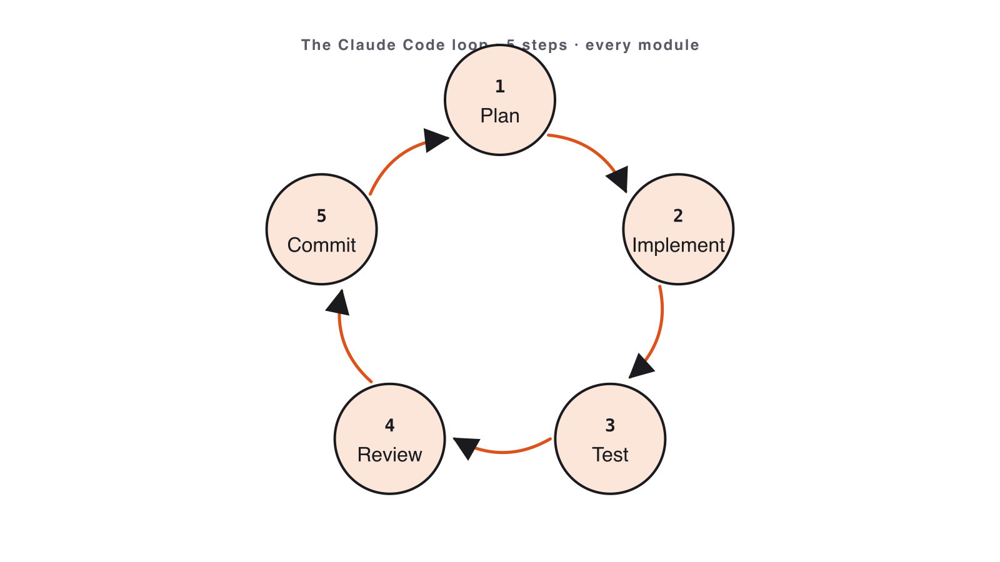
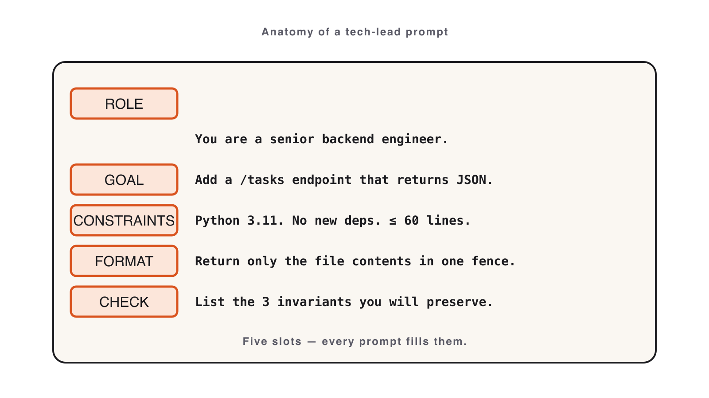
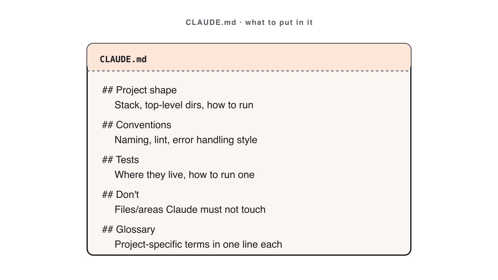

# Volume 1 — The Basics

_Source: https://leanpub.com/library/take/leanpub/claude-code-masterclass/99479/2_

---

# Volume 1 — The Basics

Install Claude Code, internalize the five-step loop, write Tech-Lead-grade prompts, and make Claude obey your repo automatically with a `CLAUDE.md`.
---
## Welcome & How This Course Works

📺 [Watch: youtube.com/watch?v=bCXGYtKLtmE](https://www.youtube.com/watch?v=bCXGYtKLtmE)

Figure 1. Watch the lesson — Welcome & How This Course Works

Welcome to the **Claude Code Masterclass**. Over these four volumes you will build small, real projects with Claude Code — one repeatable loop you can take straight back to work on Monday.

This is not a theory course. Every lecture ends with you shipping something that runs. And every lecture stands on its own: take them in order, or drop into the one you need today.

> **The golden rule:** You direct. Claude implements. You review and merge. **You are always the engineer of record.**

### How this works

- **Four volumes, fourteen short lectures.** Watch in order or jump in.
    
- **Same rhythm every time:** theory → one live demo → you build → recap.
    
- **Self-contained lectures** — nothing carried over you must set up first.
    

### Your instructor — Luca Berton

- **Automation engineer & educator** — 15+ years shipping infrastructure-as-code, Ansible, and developer tooling for global enterprises.
    
- **Author & speaker** — books on Ansible and DevOps; runs a YouTube channel on automation.
    
- **AI-paired delivery practitioner** — uses Claude Code daily to plan, refactor, document, and review production code.
    

🔗 [lucaberton.com](https://lucaberton.com/)

### Before you start (~30 min)

| Need | Minimum |
| --- | --- |
| Claude Code | Installed + signed in (paid tier: Pro, Max, Team, Enterprise, or Console) |
| Python | 3.11+ on `PATH` |
| Node.js | 20+ (secondary track) |
| Git | 2.30+ |

The free Claude.ai plan does **not** include Claude Code access — you need a paid tier. The next lecture walks you through install and sign-in.

### What you’ll learn

- **Volume 1 — The Basics:** the AI coding loop, Tech-Lead prompting, `CLAUDE.md`.
    
- **Volume 2 — Generating Better Code:** Best-of-N, testing & self-review, git.
    
- **Volume 3 — Beyond Code:** screenshot-to-UI, constrained refactor, Skills.
    
- **Volume 4 — Automation & Production:** MCP, hooks, readiness, next steps.
    

Let’s begin.
---
## Setup & the AI-First Mindset

📺 [Watch: youtube.com/watch?v=HGdBijSkgVo](https://www.youtube.com/watch?v=HGdBijSkgVo)

Figure 2. Watch the lesson — Setup & the AI-First Mindset

This course is hands-on: every lecture asks you to run **Claude Code** in your own terminal. If you have not installed it yet, this takes about five minutes — do it now.

### Install

The native installer is the recommended path on every platform:

```bash
# macOS, Linux, or Windows (WSL)
curl -fsSL https://claude.ai/install.sh | bash
```

```bash
# Windows (PowerShell)
irm https://claude.ai/install.ps1 | iex
```

Prefer npm? Claude Code also ships as a global package (requires Node.js 18+):

```bash
npm install -g @anthropic-ai/claude-code
```

Native installs update themselves in the background, so you stay current without any extra steps.

### Verify & sign in

```bash
claude --version
claude doctor   # deeper check of your install and configuration
claude          # start in any project folder; follow the browser prompt to sign in
```

Claude Code needs a **Pro, Max, Team, Enterprise, or Console** account — the free Claude.ai plan does not include access.

### Anthropic & the Claude models

**Anthropic** builds Claude — frontier models with a safety-first focus. **Claude Code** is their agentic coding tool.

| Model | Best for | Trade-off |
| --- | --- | --- |
| **Claude Opus** | Hardest reasoning: architecture, gnarly refactors, multi-file plans | Slowest · highest cost |
| **Claude Sonnet** | The daily driver: most coding, reviews, tests | Balanced speed / cost / quality |
| **Claude Haiku** | Fast, cheap: quick edits, summaries, high-volume calls | Less depth on hard problems |

**Rule of thumb:** start on **Sonnet**. Escalate to **Opus** when stuck on design. Drop to **Haiku** for bulk/trivial work. Switch live with `/model`.

### The AI coding loop

You stay the engineer of record. Claude proposes; you decide. Every lecture repeats the same five steps:



Figure 3. The five-step Claude Code loop: Plan, Implement, Test, Review, Commit

> **Plan → Implement → Test → Review → Commit**

- **Plan** — write the prompt the way a Tech Lead writes a spec.
    
- **Implement** — let Claude generate; you read every line.
    
- **Test** — run it. If it doesn’t run, you have nothing.
    
- **Review** — read it as if it came from a stranger’s PR.
    
- **Commit** — atomic commits, written prose, no `Co-authored-by: Claude`.
    

**Skipping Review is the #1 way AI-generated bugs reach production.** Keep that in mind — the quiz at the end of this volume asks about it.

### Claude Code is everywhere

Claude Code ships on **four surfaces** with one shared context: the **terminal**, **VS Code / JetBrains**, the **desktop app**, and the **web**. We work in terminal

- IDE; the patterns transfer to the other surfaces unchanged.
    

### Slash commands cheat sheet

| Command | What it does |
| --- | --- |
| `/help` | List every available slash command |
| `/init` | Scaffold a `CLAUDE.md` for the current repo |
| `/clear` | Reset the conversation (forget context) |
| `/compact` | Compress history (keeps a summary, saves tokens) |
| `/model` | Switch model: Sonnet / Opus / Haiku |
| `/cost` | Show token spend and session cost |
| `/review` | Review the working-tree diff |
| `/memory` | Open the memory editor |
| `/doctor` | Diagnose env, auth, and integrations |

### Try it yourself

1.  Capture your environment:
    
    ```bash
    mkdir -p module-01
    { python3 --version; node --version; git --version; } > module-01/environment.txt
    ```
    
2.  Ask Claude to explain the loop, then **rewrite the reply in your own words** into `module-01/loop-notes.md`:
    
    ```
    In one short paragraph (≤ 6 sentences), explain the loop:
    Plan → Implement → Test → Review → Commit.
    End with one sentence on why skipping Review is the most common failure mode.
    ```
    

**Success signal:** `module-01/` contains both files; the notes name all five steps in order, in your own words.

**Next:** we apply step 1 (Plan) by writing prompts a Tech Lead would sign off on.
---
## Hands-on exercise

> **Companion repository** — Work this exercise from the live files in the [Claude Code Bootcamp repository](https://github.com/lucab85/Claude-Code-Bootcamp): [`exercises/part-01/README.md`](https://github.com/lucab85/Claude-Code-Bootcamp/blob/main/exercises/part-01/README.md). Reference solution: [`exercises/part-01/solution/README.md`](https://github.com/lucab85/Claude-Code-Bootcamp/blob/main/exercises/part-01/solution/README.md).

### Goal

Verify your environment and articulate the AI coding loop in your own words.

### Scenario

Before the first prompt, prove your toolchain works and write down — in your own words — how you’ll use Claude Code today.

### Starter instructions

1.  Open a terminal in a working directory you’ll use for the day.
    
2.  Create `module-01/`.
    
3.  Confirm the bootcamp repo is cloned (you ran this in pre-work).
    

### Claude Code prompt to use

```
You are onboarding a new engineer who has never used AI-paired coding.
In one short paragraph (max 6 sentences), explain the loop:
Plan → Implement → Test → Review → Commit.
Use the metaphor of directing a junior engineer.
End with one sentence about why skipping the Review step is the most common failure mode.
```

### Build the deliverables

This module has **two** files to produce. Neither is created automatically — you write both by hand.

**1\. `environment.txt`** — capture the three version checks. Paste one command at a time:

```bash
mkdir -p module-01
python3 --version  > module-01/environment.txt
node --version    >> module-01/environment.txt
git --version     >> module-01/environment.txt
```

**2\. `loop-notes.md`** — Claude’s answer is your _raw material_, not the deliverable. Read what Claude wrote, then **rewrite the loop in your own words** and save it. Open the file in your editor and paste your reworded paragraph, or from the terminal:

```
cat > module-01/loop-notes.md
```

Type or paste your paragraph, then press **Enter** and **Ctrl-D** to save. Do not paste Claude’s text verbatim — the goal is that _you_ can explain the loop. (Reusing Claude’s exact wording fails the Definition of done below.)

### Manual validation steps

Run each command and check it against the note beside it. Paste **one command at a time** — interactive zsh does not treat `#` as a comment, so don’t paste the descriptions.

```bash
python3 --version
node --version
git --version
cat module-01/loop-notes.md
```

Expected:

- `python3 --version` → 3.11.x or higher
    
- `node --version` → v20.x.x or higher
    
- `git --version` → any recent Git
    
- `cat module-01/loop-notes.md` → non-empty; names all 5 steps in order, in your own words
    

If `cat` reports `No such file or directory`, you have not saved Claude’s answer yet: create `module-01/loop-notes.md` and paste your one-paragraph explanation into it first.

### Expected deliverable

```
module-01/
├── environment.txt   # output of the three --version commands
└── loop-notes.md     # your one-paragraph loop explanation
```

### Definition of done

- [ ] `environment.txt` shows valid Python 3.11+, Node 20+, Git versions.
    
- [ ] `loop-notes.md` names all 5 steps in order.
    
- [ ] Notes are in _your_ words — not Claude’s verbatim output.
    

### Stretch challenge

Write a second paragraph in `loop-notes.md` describing one situation in your day job where the loop would have caught a bug.

### Troubleshooting

| Symptom | Fix |
| --- | --- |
| `python3` not found | Re-run pre-work install steps (`student-guide.md`). |
| `node` not found | Install Node 20 LTS. |
| WSL2 issues | Always run inside the Ubuntu shell, never PowerShell. |
| Claude Code unresponsive | Verify you’re authenticated; pair with a neighbor for module 1 only. |

## Solution

> **Stop**: only open this after you have produced your own `module-01/` deliverable.

This module’s deliverable is a **workspace** (not running code), so the reference solution is a worked example of what a strong submission contains. Compare your `module-01/` against the checklist below; do not copy.

### What a strong `module-01/` contains

```
module-01/
├── environment.txt   # output of: python3 --version, node --version, git --version
└── loop-notes.md     # your one-paragraph explanation of the loop, in your own words
```

### The verification check

Confirm your toolchain, then read back your notes (paste one command at a time):

```bash
python3 --version
node --version
git --version
cat module-01/loop-notes.md
```

A strong `loop-notes.md` names all five steps in order — **Plan → Implement → Test → Review → Commit** — in your own words, and closes with why skipping **Review** is the most common failure mode. The reference paragraph looks like this (truncated):

```
Working with Claude Code is like directing a junior engineer: you Plan the task as a
clear spec, let Claude Implement it, then Test that it runs, Review every line as if it
came from a stranger's PR, and only then Commit. Skipping Review is the #1 way
AI-generated bugs reach production.
```

### Definition of done (mirror of the exercise)

- [ ] `module-01/environment.txt` shows valid Python 3.11+, Node 20+, and Git versions.
    
- [ ] `module-01/loop-notes.md` names all 5 steps in order, in _your_ words — not Claude’s verbatim output.
    
- [ ] You can articulate the **plan → implement → test → review → commit** loop without notes.
---
## Prompting Like a Tech Lead

📺 [Watch: youtube.com/watch?v=E3qKFwHX8KQ](https://www.youtube.com/watch?v=E3qKFwHX8KQ)

Figure 4. Watch the lesson — Prompting Like a Tech Lead

**A great prompt is a spec. Write it the way a Tech Lead writes a ticket.**

### The GCOE prompt

A production prompt has **four parts — skip one and quality drops**:

> **G**oal · **C**onstraints · **O**utput format · **E**xamples

- **Goal** — one verb-led sentence: what can the user _do_ at the end?
    
- **Constraints** — language, deps, file layout, error handling, and what must **not** happen.
    
- **Output format** — files, exit codes, JSON shapes if any.
    
- **Examples** — one happy path + one edge case is enough to disambiguate.
    

A vague prompt produces plausible code that fails review. GCOE produces code you can merge.



Figure 5. GCOE prompt anatomy: Goal, Constraints, Output, Examples

### GCOE skeleton you can paste

```
GOAL: A user can <verb> <thing> from the command line.

CONSTRAINTS:
- Language: Python 3.11, standard library only (no third-party deps).
- Persist state to ./tasks.json.
- Exit codes: 0 success, 1 user error, 2 internal error.

OUTPUT:
- A single runnable script + a short README with usage.

EXAMPLES:
- `task add "Buy milk"` -> prints new id, exit 0.
- `task done 999` (missing id) -> prints error to stderr, exit 1.
```

Keep it tight. Every line removes one wrong guess Claude could make.

### Common mistakes

- “Build a CLI” with no constraints — looks fine, fails review.
    
- Allowing unintended third-party deps (the constraint exists for a reason).
    
- Skipping examples and exit codes — production CLIs are graded on exit codes, not stdout.
    

### Worked example · Vague vs. GCOE

Run the vague prompt first:

```
Make a CLI to manage tasks.
```

Then re-run with GCOE:

```
GOAL: A user can add, list, complete, and delete tasks from the command line.
CONSTRAINTS: Python 3.11, stdlib only; persist to ./tasks.json;
  exit codes 0 success / 1 user error / 2 internal error.
OUTPUT: one runnable script + a short usage README.
EXAMPLES: `task add "Buy milk"` -> prints id, exit 0;
  `task done 999` -> stderr error, exit 1.
```

**Success signal:** the GCOE version runs all four commands with correct exit codes; the vague one doesn’t.

### Try it yourself · CLI Task Manager

Build a CLI with four commands, persisted to `tasks.json`:

```
task add "<title>"        # -> prints new id
task list [--status STATE]
task done <id>
task delete <id>
```

Start from the GCOE skeleton; fill Goal / Constraints / Output / Examples for _your_ task manager.

**Deliverable:** working CLI in `module-02/` + `iteration-notes.md` recording one deleted constraint and its code diff.

**Definition of done**

- [ ] Four commands work; `tasks.json` round-trips state.
    
- [ ] Exit codes correct (`0` / `1` / `2`).
    
- [ ] `iteration-notes.md` documents one deleted constraint + diff.
    

**Next:** a good prompt is per-task. Now we make Claude follow your repo’s rules _automatically_ — with a `CLAUDE.md`.
---
## Hands-on exercise

> **Companion repository** — Work this exercise from the live files in the [Claude Code Bootcamp repository](https://github.com/lucab85/Claude-Code-Bootcamp): [`exercises/part-02/README.md`](https://github.com/lucab85/Claude-Code-Bootcamp/blob/main/exercises/part-02/README.md). Reference solution: [`exercises/part-02/solution/README.md`](https://github.com/lucab85/Claude-Code-Bootcamp/blob/main/exercises/part-02/solution/README.md).

### Goal

Ship a CLI Task Manager (add, list, done, delete) with JSON persistence, using a Tech-Lead-grade GCOE prompt.

### Scenario

A teammate asks for a quick CLI to track personal tasks. They have not specified anything beyond “make it work”. You translate that ask into a precise prompt and ship a working tool in one pass. Then you iterate one prompt edit and document the diff.

### Starter instructions

1.  Pick your track:
    
    - **Track A — Python** (3.11, stdlib only, `argparse`).
        
    - **Track B — Node + TypeScript** (Node 20, `commander`, `tsx`).
        
    
2.  Create `module-02/` for submission and a working folder for code.
    
3.  Open Claude Code in the working folder.
    

### Claude Code prompt to use

```
GOAL
Build a single-binary CLI Task Manager so a developer can manage TODOs from the terminal.

CONSTRAINTS
- Language: Python 3.11 (stdlib only) — OR — TypeScript on Node.js 20 with `commander` + `tsx`.
- Persistence: a single JSON file `tasks.json` in CWD.
- No background processes. No network calls.
- Exit code 0 on success, 1 on user error, 2 on internal error.
- All user-facing strings in English.

OUTPUT FORMAT
- One source file (Python) or `src/index.ts` + `package.json` (Node).
- A short README explaining install + the four commands.

EXAMPLES
- `task add "Write the spec"` → "Added task #1: Write the spec"
- `task list` → tabular: id, status, created_at, text
- `task done 1` → "Marked #1 as done"
- `task delete 99` → exit 1, "No task with id 99"
```

### Manual validation steps

**Python (track A):**

```
python3 task.py add "Write the spec"
python3 task.py list
python3 task.py done 1
python3 task.py delete 99
```

Expected: `add` exits 0; `list` shows the task; `done 1` exits 0; `delete 99` exits 1.

**Node (track B):**

```bash
npx tsx src/index.ts add "Write the spec"
npx tsx src/index.ts list
npx tsx src/index.ts done 1
npx tsx src/index.ts delete 99
```

Expected: `delete 99` exits 1; the other commands exit 0.

Confirm `tasks.json` round-trips state across runs.

### Expected deliverable

```
module-02/
├── <source files for chosen track>
├── README.md
└── iteration-notes.md   # one prompt edit + the resulting diff summary
```

A reference solution covering both tracks lives at `solution/` once you’ve completed the lab.

### Definition of done

- [ ] All four commands return correct exit codes.
    
- [ ] `tasks.json` persists across runs.
    
- [ ] `iteration-notes.md` documents one prompt edit and what changed.
    
- [ ] Reference solution **not** consulted before completing.
    

### Stretch challenge

Add `task list --status open` and `task list --status done` filters. Document the prompt change in `iteration-notes.md`.

### Troubleshooting

| Symptom | Fix |
| --- | --- |
| `tasks.json` not created | Confirm CWD is writable; check Claude added file I/O. |
| Empty list after add | Round-trip bug — Claude likely forgot to flush; re-prompt with that constraint. |
| Node track: `tsx` not found | `npm i -D tsx`. |
| Python track: third-party deps appeared | Re-prompt with the “stdlib only” constraint reinforced. |

## Solution

> **Stop**: only open this after you have produced `module-02/cli.py` (or `cli.js`) and `PROMPT.md`.

Two parallel tracks ship under this directory. Pick the one matching your stack and diff your work against it:

| Track | Path | Run |
| --- | --- | --- |
| Python (primary) | `python/` | `python3 python/cli.py add "first task"` |
| Node.js (secondary) | `node/` | `node node/cli.js add "first task"` |

Both implement the same CLI Task Manager spec from the exercise above. They are not byte-identical: differences highlight where Best-of-N (Module 4) would choose between them.

### What to compare

1.  **`PROMPT.md` shape** — does yours follow GCOE (Goal · Constraints · Output · Examples)?
    
2.  **Command surface** — `add`, `list`, `done`, `delete`, `--help`.
    
3.  **Persistence** — both use a single JSON file (`tasks.json`) in the project root.
    
4.  **Error paths** — empty input, missing ID, broken JSON.
    

### Definition of done

See the exercise above — the rubric is unchanged.
---
## CLAUDE.md Brain Files

📺 [Watch: youtube.com/watch?v=4Zg2vdgPGjY](https://www.youtube.com/watch?v=4Zg2vdgPGjY)

Figure 6. Watch the lesson — CLAUDE.md Brain Files

**Stop re-explaining your stack. Write it once; Claude reads it every prompt.**

### CLAUDE.md is a behavior file

`CLAUDE.md` lives at the repo root. Claude reads it **automatically on every prompt**.

> It is a _behavior_ file, not documentation. Every line must change Claude’s output.

Five sections earn their place:

- **Stack** — languages, versions, frameworks.
    
- **Conventions** — naming, layout, lint rules.
    
- **Commands** — exact build / test / run / lint.
    
- **Do-not** — hard lessons, the traps.
    
- **Glossary** — domain terms only your team uses.
    

**Trim test:** delete a section; if Claude behaves the same, it was bloat. Aim **under 80 lines**.



Figure 7. CLAUDE.md cheat sheet: Stack, Conventions, Commands, Do-not, Glossary

### A lean CLAUDE.md (≤ 80 lines)

```
# CLAUDE.md

## Stack
- Python 3.11, standard library only.

## Conventions
- snake_case files; one command per module under cli/.
- Lint: ruff. Format: black.

## Commands
- Test:  pytest -q
- Run:   python -m taskcli
- Lint:  ruff check .

## Do-not
- Do NOT add third-party deps without asking.
- Do NOT swallow exceptions; surface exit codes.
```

### Common mistakes

- Writing an `ABOUT.md` (documentation) instead of a behavior file.
    
- 200 lines of bloat instead of a lean 80.
    
- Skipping **Do-not** — and not committing the file (if it’s not in git, it isn’t real).
    

### Worked example · Before vs. after CLAUDE.md

Run this prompt twice, unchanged — once with no `CLAUDE.md`, once with one:

```
Add an `--export csv` flag to the task CLI that writes all tasks
to a file. Match the project's existing conventions.
```

1.  On the Module 2 repo with **no** `CLAUDE.md` → off-convention output.
    
2.  Drop in a 12-line `CLAUDE.md`; in a **fresh chat**, paste the **same** prompt → now follows conventions.
    
3.  Trim test: delete one section, re-prompt, observe the drift.
    

**Success signal:** with `CLAUDE.md` present, Claude matches your naming/layout without being told.

### Try it yourself · Author your CLAUDE.md

Write a `CLAUDE.md` for your Module 2 repo (or a personal repo):

- All five sections: **Stack · Conventions · Commands · Do-not · Glossary**.
    
- **Under 80 lines.** Run the **trim test** at least once.
    

Prompt:

```
Read this repo and draft a CLAUDE.md with Stack, Conventions, Commands,
Do-not, Glossary. Keep it under 80 lines; every line must change your behavior.
```

**Definition of done**

- [ ] `CLAUDE.md` < 80 lines, all five sections, committed to git.
    
- [ ] Trim test performed at least once.
    
- [ ] Proof that Claude obeyed one convention without being told.
    

**Next:** with rules in place, we generate _several_ solutions and pick the best — Best-of-N, in Volume 2.
---
## Hands-on exercise

> **Companion repository** — Work this exercise from the live files in the [Claude Code Bootcamp repository](https://github.com/lucab85/Claude-Code-Bootcamp): [`exercises/part-03/README.md`](https://github.com/lucab85/Claude-Code-Bootcamp/blob/main/exercises/part-03/README.md). Reference solution: [`exercises/part-03/solution/README.md`](https://github.com/lucab85/Claude-Code-Bootcamp/blob/main/exercises/part-03/solution/README.md).

### Goal

Author a `CLAUDE.md` for a real repo and prove Claude follows it on the next prompt.

### Scenario

You inherit a repo. Every time you prompt Claude, you re-explain stack, conventions, and “do nots”. That waste is what `CLAUDE.md` exists to remove. Today you commit one — and earn it back.

### What you’ll do (overview)

In one sentence: **draft a `CLAUDE.md`, commit it to a real repo, then prove in a fresh chat that Claude actually obeys one of its rules.** The five numbered steps below walk you through it.

### Starter instructions

1.  Pick a repo: your module-2 work, or any personal repo you trust to commit to.
    
2.  `cd` into it.
    
3.  Create `module-03/` in your submission directory (this is where your two deliverables go).
    
4.  Open `skills/claude-md-template/SKILL.md` for the template and section guidance.
    

### Claude Code prompt to use

This is **Step 1 — draft CLAUDE.md**. Run this prompt from the **root** of the repo you picked:

```
You are drafting CLAUDE.md for the repo at the current working directory.
Read the repo first. Then propose a CLAUDE.md with these sections:

# Stack       — languages, package managers, runtime versions
# Conventions — naming, file layout, lint/format rules
# Commands    — exact commands for build, test, run, lint
# Do-not      — things you must never do (e.g., add deps without asking)
# Glossary    — domain terms only this team uses

Each line must change your behavior on a future prompt. If a line is just
documentation, omit it. Keep the whole file under 80 lines.
```

### Manual validation steps

Work through Steps 2–5 below, then run the final checks.

#### Step 2 — Save and commit it

1.  Save Claude’s proposal as `CLAUDE.md` at the **repo root** (not inside `module-03/`).
    
2.  Read every line. Delete any line that is just documentation and would not change Claude’s behaviour.
    
3.  Commit it to the repo: `git add CLAUDE.md && git commit -m "Add CLAUDE.md"`.
    
4.  Copy the committed file into your submission folder: `cp CLAUDE.md module-03/CLAUDE.md`.
    

#### Step 3 — Prove Claude obeys it

1.  Open a **fresh** Claude Code chat in the same repo (so the new `CLAUDE.md` is loaded).
    
2.  Ask one prompt whose correct answer depends on a line in your `Conventions` section — for example, ask Claude to create a new file or function and watch whether it follows your naming rule.
    
3.  Confirm Claude follows the convention **without you re-stating it**.
    
4.  Screenshot that obedient response and save it as `module-03/proof.png`.
    

> **Example prompt.** Notice it never mentions any convention — that is the point; you are testing whether `CLAUDE.md` silently steers the output:
> 
> ```
> Create module-03/greet.py: a small CLI with a subcommand `hello <name>`
> that prints "Hello, `<name>`!". Add a `--upper` flag that uppercases it.
> ```
> 
> **Claude obeyed** if, without being asked, it: starts with `#!/usr/bin/env python3`, uses `argparse` subcommands, gives each function a one-line docstring, and exits `0`/`1` per your rules. **Claude ignored** the file if you see multi-line docstrings, hand-rolled `sys.argv` parsing, or no shebang (recheck you’re in a fresh chat at repo root).
> 
> For the most unmistakable single-line proof, target one high-signal rule instead:
> 
> ```
> Add a function to module-03/greet.py that logs the current time.
> ```
> 
> Obeys → `datetime.now(timezone.utc).isoformat()` (ISO-8601 UTC). Ignored → `datetime.now()` (local, no tz) or `time.time()`. That one-line diff is the easiest thing to capture as `proof.png`.

#### Step 4 — Run the trim test

The _trim test_ checks that every section actually earns its place:

1.  Temporarily delete one section from `CLAUDE.md` (start with `Conventions`).
    
2.  Re-ask a prompt that depended on it in a fresh chat.
    
3.  Observe whether Claude’s behaviour drifts (e.g., wrong naming, wrong commands).
    
4.  Restore the section. Be ready to **name one line you could delete and why** — that is part of the Definition of done.
    

#### Step 5 — Validate

1.  `wc -l CLAUDE.md` → ≤ 80.
    
2.  Confirm all five H1 sections are present: `Stack`, `Conventions`, `Commands`, `Do-not`, `Glossary`.
    
3.  Confirm `CLAUDE.md` is committed to the underlying repo (`git log -- CLAUDE.md` shows your commit).
    
4.  Confirm `module-03/CLAUDE.md` and `module-03/proof.png` both exist.
    

### Expected deliverable

```
module-03/
├── CLAUDE.md      # copy of the file you committed to the underlying repo
└── proof.png      # screenshot of Claude obeying one convention
```

### Definition of done

- [ ] File is committed to the underlying repo (not just sitting in the submission folder).
    
- [ ] All five H1 sections present.
    
- [ ] ≤ 80 lines total.
    
- [ ] `proof.png` shows Claude obeying.
    
- [ ] You can name one line you deleted in the trim test, and why.
    

### Stretch challenge

Extend the trim test to _every_ section: delete each one in turn, re-prompt, and observe the drift. Document which section caused the largest behaviour regression in `module-03/trim-notes.md`.

### Troubleshooting

| Symptom | Fix |
| --- | --- |
| File over 80 lines | Trim ruthlessly — every line must change behavior. |
| Claude ignores the file | Confirm it’s at repo root and you’re in a fresh chat. |
| Proof screenshot is unconvincing | Re-pick a convention that produces a visible diff in output. |

## Solution

> **Stop**: only open this after you have authored your own `module-03/CLAUDE.md`.

This module produces a **document**, not running code, so the reference solution is a worked `CLAUDE.md` you can diff against.

```
module-03/
├── CLAUDE.md   # your project brain file (copy of the one committed to the repo root)
└── proof.png   # screenshot of Claude obeying one convention in a fresh chat
```

### Worked example `CLAUDE.md`

This is a real, corrected `CLAUDE.md` generated for this training repo. It keeps the five required H1 sections (`Stack`, `Conventions`, `Commands`, `Do-not`, `Glossary`) and stays well under 80 lines. Yours should be **shorter and more specific** to your own repo.

````
# Stack

- Python 3.11+ (stdlib only — no external runtime dependencies)
- JSON for data files (indent: 2 spaces)
- Git for version control

# Conventions

Python files:
- Shebang: `#!/usr/bin/env python3`
- Docstrings: one-line only (e.g., `"""Load tasks from JSON file."""`)
- Argv parsing: use `argparse` with subcommands (not Click or Fire)
- CLI exit codes: 0 (success), 1 (user error), 2 (internal error)
- Timestamps: ISO 8601 UTC (`datetime.now(timezone.utc).isoformat()`)

Layout:
- `module-NN/task.py` — the reference solution
- `module-NN/README.md` — usage docs for that solution
- `module-NN/tasks.json` — sample data file

Format/lint: `black` and `ruff` are dev-only tools (allowed; they are not shipped deps).

# Commands

```bash
python3 module-02/task.py list      # run the CLI
python3 -m pytest -q                # run tests
ruff check .                        # lint
```

# Do-not

- Never add external *runtime* dependencies — solutions stay `stdlib`-only.
- Never commit non-template data files; `.gitignore` generated `tasks.json`.
- Don't change the `module-NN/` layout without updating `instructor-guide.md`.

# Glossary

- Reference solution — working implementation of an exercise (lives in `module-NN/`).
- Module — numbered bootcamp part (01–11); each has slides, an exercise, and a solution.
- Bootcamp — the live virtual event; students work modules in order during the session.
````

### Review checklist — common AI deviations

A first-pass generated `CLAUDE.md` (especially from a faster/weaker model) usually needs editing before you commit it. These are the issues caught in the example above — use them during the **Review** step:

1.  **Self-contradicting exclusion list.** “use `argparse` … (not Click, **argparse**, or fire)” listed `argparse` in its own do-not list. Fixed to `(not Click or Fire)`.
    
2.  **Tooling vs the no-deps rule.** The draft named `black` as the formatter while `Do-not` said “stdlib-only, no external dependencies.” Scope the rule to _runtime_ deps so dev tools (`black`, `ruff`) are allowed — or drop them.
    
3.  **Thin `Commands` section.** The spec asks for build/test/run/**lint**. The draft only had `chmod` + a manual run; add real `pytest`/`ruff` commands so a future prompt like “how do I run tests?” is answerable.
    
4.  **Grammar bug.** “`*.json` … should .gitignore’d” → “should be `.gitignore`d”.
    
5.  **Over-meta content.** A draft may describe the _bootcamp_ rather than the repo you actually work in. Keep lines that change Claude’s behaviour on real edits; cut pure documentation.
    

> Teaching point: every line must _change behaviour on a future prompt_. The `Conventions` section here is the highest-value (exit codes, timestamp format, docstrings); `Glossary` is the weakest — a good candidate for the trim test’s “name one line you could delete and why.”

### Worked proof of obedience

`greet.example.py` is a real response to the convention-free Step 3 prompt (_“Create greet.py: a CLI with a `hello <name>` subcommand … add a `--upper` flag”_). The prompt never named a single rule, yet the output obeys four `Conventions` lines from the `CLAUDE.md` above:

| Convention | In `greet.example.py` |
| --- | --- |
| Shebang `#!/usr/bin/env python3` | line 1 |
| One-line docstrings | `"""Greeting CLI."""` |
| `argparse` with subcommands | `add_subparsers()` + `hello` |
| Exit codes 0/1/2 | `raise SystemExit(1)` on no command; 0 on success |

That silent obedience — four rules followed without restating them — is exactly what `proof.png` should capture (screenshot the prompt next to this output). Two honest nitpicks for the Review step: `main()` itself lacks a one-line docstring, and `argparse` exits `2` on a malformed flag (its built-in behaviour), slightly at odds with the “2 = internal error” rule.

### Definition of done

- [ ] All five H1 sections present: `Stack`, `Conventions`, `Commands`, `Do-not`, `Glossary`.
    
- [ ] ≤ 80 lines, specific to your repo (no generic placeholders).
    
- [ ] `CLAUDE.md` committed to the underlying repo (not just the submission folder).
    
- [ ] `proof.png` shows Claude obeying one convention in a fresh chat.
    
- [ ] You can name one line you deleted in the trim test, and why.
---
## Quiz — The Basics
---
[

Up next

Volume 2 — Generating Better Code

Turn one noisy answer into a reviewed artifact: generate candidates, test them, self-review like a stranger’s PR, and ship through clean git history.

](/library/take/leanpub/claude-code-masterclass/99479/3)

## On this page

- [Welcome & How This Course Works](/library/take/leanpub/claude-code-masterclass/99479/2#welcome--how-this-course-works)
- [How this works](/library/take/leanpub/claude-code-masterclass/99479/2#how-this-works)
- [Your instructor — Luca Berton](/library/take/leanpub/claude-code-masterclass/99479/2#your-instructor--luca-berton)
- [Before you start (~30 min)](/library/take/leanpub/claude-code-masterclass/99479/2#before-you-start-30-min)
- [What you’ll learn](/library/take/leanpub/claude-code-masterclass/99479/2#what-youll-learn)
- [Setup & the AI-First Mindset](/library/take/leanpub/claude-code-masterclass/99479/2#setup--the-ai-first-mindset)
- [Install](/library/take/leanpub/claude-code-masterclass/99479/2#install)
- [Verify & sign in](/library/take/leanpub/claude-code-masterclass/99479/2#verify--sign-in)
- [Anthropic & the Claude models](/library/take/leanpub/claude-code-masterclass/99479/2#anthropic--the-claude-models)
- [The AI coding loop](/library/take/leanpub/claude-code-masterclass/99479/2#the-ai-coding-loop)
- [Claude Code is everywhere](/library/take/leanpub/claude-code-masterclass/99479/2#claude-code-is-everywhere)
- [Slash commands cheat sheet](/library/take/leanpub/claude-code-masterclass/99479/2#slash-commands-cheat-sheet)
- [Try it yourself](/library/take/leanpub/claude-code-masterclass/99479/2#try-it-yourself)
- [Hands-on exercise](/library/take/leanpub/claude-code-masterclass/99479/2#hands-on-exercise--module-01)
- [Goal](/library/take/leanpub/claude-code-masterclass/99479/2#goal)
- [Scenario](/library/take/leanpub/claude-code-masterclass/99479/2#scenario)
- [Starter instructions](/library/take/leanpub/claude-code-masterclass/99479/2#starter-instructions)
- [Claude Code prompt to use](/library/take/leanpub/claude-code-masterclass/99479/2#claude-code-prompt-to-use)
- [Build the deliverables](/library/take/leanpub/claude-code-masterclass/99479/2#build-the-deliverables)
- [Manual validation steps](/library/take/leanpub/claude-code-masterclass/99479/2#manual-validation-steps)
- [Expected deliverable](/library/take/leanpub/claude-code-masterclass/99479/2#expected-deliverable)
- [Definition of done](/library/take/leanpub/claude-code-masterclass/99479/2#definition-of-done)
- [Stretch challenge](/library/take/leanpub/claude-code-masterclass/99479/2#stretch-challenge)
- [Troubleshooting](/library/take/leanpub/claude-code-masterclass/99479/2#troubleshooting)
- [Solution](/library/take/leanpub/claude-code-masterclass/99479/2#solution--module-01)
- [What a strong module-01/ contains](/library/take/leanpub/claude-code-masterclass/99479/2#what-a-strong-module-01-contains)
- [The verification check](/library/take/leanpub/claude-code-masterclass/99479/2#the-verification-check)
- [Definition of done (mirror of the exercise)](/library/take/leanpub/claude-code-masterclass/99479/2#definition-of-done-mirror-of-the-exercise)
- [Prompting Like a Tech Lead](/library/take/leanpub/claude-code-masterclass/99479/2#prompting-like-a-tech-lead)
- [The GCOE prompt](/library/take/leanpub/claude-code-masterclass/99479/2#the-gcoe-prompt)
- [GCOE skeleton you can paste](/library/take/leanpub/claude-code-masterclass/99479/2#gcoe-skeleton-you-can-paste)
- [Common mistakes](/library/take/leanpub/claude-code-masterclass/99479/2#common-mistakes)
- [Worked example · Vague vs. GCOE](/library/take/leanpub/claude-code-masterclass/99479/2#worked-example--vague-vs-gcoe)
- [Try it yourself · CLI Task Manager](/library/take/leanpub/claude-code-masterclass/99479/2#try-it-yourself--cli-task-manager)
- [Hands-on exercise](/library/take/leanpub/claude-code-masterclass/99479/2#hands-on-exercise--module-02)
- [Goal](/library/take/leanpub/claude-code-masterclass/99479/2#goal-1)
- [Scenario](/library/take/leanpub/claude-code-masterclass/99479/2#scenario-1)
- [Starter instructions](/library/take/leanpub/claude-code-masterclass/99479/2#starter-instructions-1)
- [Claude Code prompt to use](/library/take/leanpub/claude-code-masterclass/99479/2#claude-code-prompt-to-use-1)
- [Manual validation steps](/library/take/leanpub/claude-code-masterclass/99479/2#manual-validation-steps-1)
- [Expected deliverable](/library/take/leanpub/claude-code-masterclass/99479/2#expected-deliverable-1)
- [Definition of done](/library/take/leanpub/claude-code-masterclass/99479/2#definition-of-done-1)
- [Stretch challenge](/library/take/leanpub/claude-code-masterclass/99479/2#stretch-challenge-1)
- [Troubleshooting](/library/take/leanpub/claude-code-masterclass/99479/2#troubleshooting-1)
- [Solution](/library/take/leanpub/claude-code-masterclass/99479/2#solution--module-02)
- [What to compare](/library/take/leanpub/claude-code-masterclass/99479/2#what-to-compare)
- [Definition of done](/library/take/leanpub/claude-code-masterclass/99479/2#definition-of-done-2)
- [CLAUDE.md Brain Files](/library/take/leanpub/claude-code-masterclass/99479/2#claudemd-brain-files)
- [CLAUDE.md is a behavior file](/library/take/leanpub/claude-code-masterclass/99479/2#claudemd-is-a-behavior-file)
- [A lean CLAUDE.md (≤ 80 lines)](/library/take/leanpub/claude-code-masterclass/99479/2#a-lean-claudemd--80-lines)
- [Common mistakes](/library/take/leanpub/claude-code-masterclass/99479/2#common-mistakes-1)
- [Worked example · Before vs. after CLAUDE.md](/library/take/leanpub/claude-code-masterclass/99479/2#worked-example--before-vs-after-claudemd)
- [Try it yourself · Author your CLAUDE.md](/library/take/leanpub/claude-code-masterclass/99479/2#try-it-yourself--author-your-claudemd)
- [Hands-on exercise](/library/take/leanpub/claude-code-masterclass/99479/2#hands-on-exercise--module-03)
- [Goal](/library/take/leanpub/claude-code-masterclass/99479/2#goal-2)
- [Scenario](/library/take/leanpub/claude-code-masterclass/99479/2#scenario-2)
- [What you’ll do (overview)](/library/take/leanpub/claude-code-masterclass/99479/2#what-youll-do-overview)
- [Starter instructions](/library/take/leanpub/claude-code-masterclass/99479/2#starter-instructions-2)
- [Claude Code prompt to use](/library/take/leanpub/claude-code-masterclass/99479/2#claude-code-prompt-to-use-2)
- [Manual validation steps](/library/take/leanpub/claude-code-masterclass/99479/2#manual-validation-steps-2)
- [Step 2 — Save and commit it](/library/take/leanpub/claude-code-masterclass/99479/2#step-2--save-and-commit-it)
- [Step 3 — Prove Claude obeys it](/library/take/leanpub/claude-code-masterclass/99479/2#step-3--prove-claude-obeys-it)
- [Step 4 — Run the trim test](/library/take/leanpub/claude-code-masterclass/99479/2#step-4--run-the-trim-test)
- [Step 5 — Validate](/library/take/leanpub/claude-code-masterclass/99479/2#step-5--validate)
- [Expected deliverable](/library/take/leanpub/claude-code-masterclass/99479/2#expected-deliverable-2)
- [Definition of done](/library/take/leanpub/claude-code-masterclass/99479/2#definition-of-done-3)
- [Stretch challenge](/library/take/leanpub/claude-code-masterclass/99479/2#stretch-challenge-2)
- [Troubleshooting](/library/take/leanpub/claude-code-masterclass/99479/2#troubleshooting-2)
- [Solution](/library/take/leanpub/claude-code-masterclass/99479/2#solution--module-03)
- [Worked example CLAUDE.md](/library/take/leanpub/claude-code-masterclass/99479/2#worked-example-claudemd)
- [Review checklist — common AI deviations](/library/take/leanpub/claude-code-masterclass/99479/2#review-checklist--common-ai-deviations)
- [Worked proof of obedience](/library/take/leanpub/claude-code-masterclass/99479/2#worked-proof-of-obedience)
- [Definition of done](/library/take/leanpub/claude-code-masterclass/99479/2#definition-of-done-4)
- [Quiz — The Basics](/library/take/leanpub/claude-code-masterclass/99479/2#quiz--the-basics)
