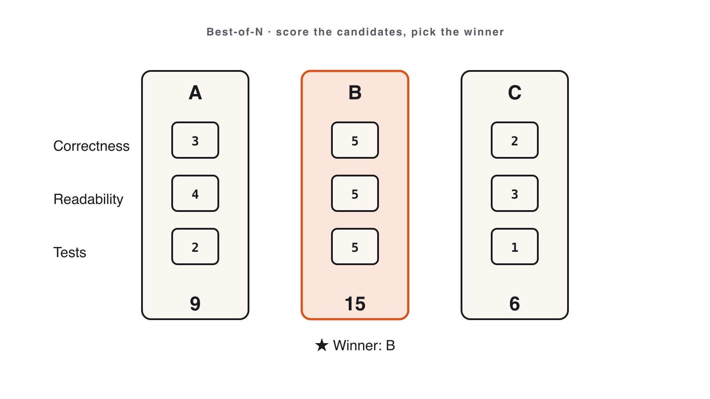
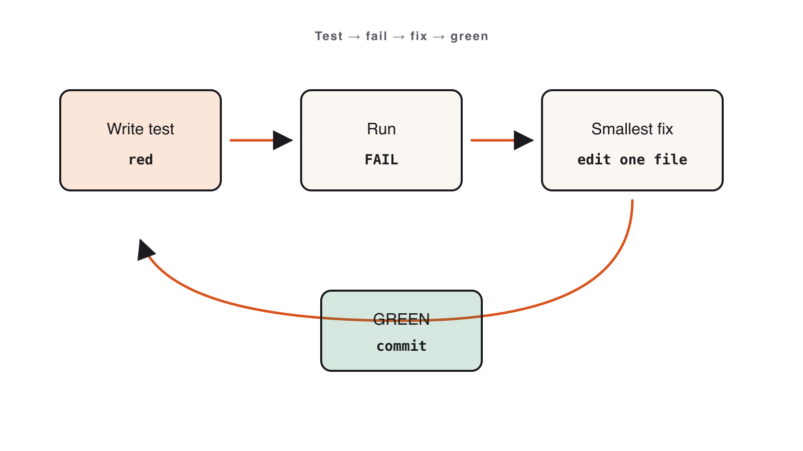
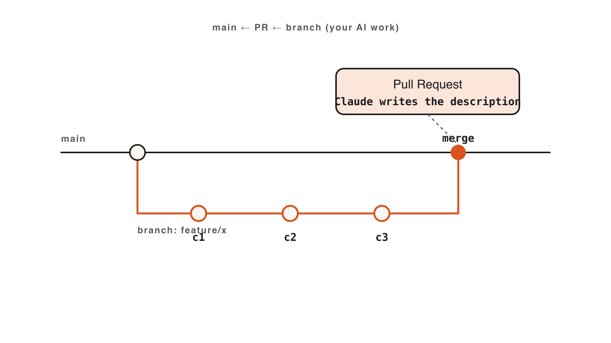

# Volume 2 — Generating Better Code

_Source: https://leanpub.com/library/take/leanpub/claude-code-masterclass/99479/3_

---

# Volume 2 — Generating Better Code

Turn one noisy answer into a reviewed artifact: generate candidates, test them, self-review like a stranger’s PR, and ship through clean git history.
---
## Best-of-N

📺 [Watch: youtube.com/watch?v=LEGzXXqaAqs](https://www.youtube.com/watch?v=LEGzXXqaAqs)

Figure 8. Watch the lesson — Best-of-N

**The first answer is rarely the best. Generate three; score; ship the winner.**

### The technique

> Generate **N** independent candidates → score on a rubric → pick the winner. N = 3 is the sweet spot.

- **Independent** — each candidate gets its own fresh prompt context. _Not_ “now improve it” (that’s iteration).
    
- **Score on a rubric**, not vibes. Three criteria:
    
    - **Correctness** — passes the manual test plan?
        
    - **Simplicity** — could a junior maintain it?
        
    - **Fit** — matches `CLAUDE.md` conventions and repo style?
        
    

**Without the rubric you pick by gut and the lift disappears. Correctness gates everything.**



Figure 9. Best-of-N: generate N candidates, score on Correctness, Simplicity, Fit, pick the winner

### The 3-criterion scorecard

| Criterion | Question | Weight |
| --- | --- | --- |
| **Correctness** | Does it pass every step of the manual test plan? | Gate — fail here = out |
| **Simplicity** | Could a junior maintain it next quarter? | High |
| **Fit** | Does it follow `CLAUDE.md` + repo style? | Medium |

Record a one-paragraph justification per candidate in `scoring.md`. **Never delete losers before scoring.**

### Common mistakes

- One candidate + “improve it” ×3 (iteration, not Best-of-N).
    
- Skipping the rubric → picking by vibe → no lift.
    
- Choosing the “elegant” one that fails the test plan (correctness is the gate).
    

### Worked example · Three candidates, one winner

Paste this reusable prompt verbatim for A, B, and C:

```
GOAL: A REST Notes API: create, list, get, delete a note.
CONSTRAINTS: Python 3.11 + FastAPI; persist to SQLite ./notes.db;
  return JSON; 404 on missing id; no other third-party deps.
OUTPUT: one runnable app + a curl test plan covering all 4 routes.
EXAMPLES: POST /notes {"text":"hi"} -> 201 + id;
  GET /notes/999 (missing) -> 404 {"error":"not found"}.
```

`/clear` before **each** candidate → paste the **same** prompt → save to `candidate-a|b|c/`. Then score side-by-side and commit the winner.

> Variance must come from the model, **not** the prompt. Never say “now do it differently.”

### Try it yourself · Notes API, Best-of-3

Build a Notes API (SQLite `notes.db`), then generate **3 candidates** and score them:

```
POST /notes · GET /notes?q= · GET /notes/:id · PATCH /notes/:id · DELETE /notes/:id
Status: 201 create · 200 read/update · 204 delete · 404 missing · 422 invalid
```

Track A: Python (FastAPI + Pydantic v2). Track B: Node (Hono + Zod + better-sqlite3).

**Deliverables:** `candidate-{a,b,c}/`, `scoring.md` (scores + justification), `winner/` (clean copy).

**Definition of done**

- [ ] Three candidates in `module-04/candidate-{a,b,c}/`.
    
- [ ] `scoring.md` with scores + one-paragraph justification each.
    
- [ ] `winner/` runs end-to-end; losers archived (not deleted).
    

**Next:** we trust the winner only after we _test_ it and review like a stranger’s PR.
---
## Hands-on exercise

> **Companion repository** — Work this exercise from the live files in the [Claude Code Bootcamp repository](https://github.com/lucab85/Claude-Code-Bootcamp): [`exercises/part-04/README.md`](https://github.com/lucab85/Claude-Code-Bootcamp/blob/main/exercises/part-04/README.md). Reference solution: [`exercises/part-04/solution/README.md`](https://github.com/lucab85/Claude-Code-Bootcamp/blob/main/exercises/part-04/solution/README.md).

### Goal

Generate **two independent** candidate Notes APIs from the _same_ prompt, score them side-by-side on the 3-criterion rubric, and ship the winner. Keep the loser — it is evidence of the lift.

### Scenario

A small team needs a Notes service. One Claude answer is just _one sample_ from a noisy process — the second answer is often meaningfully better or worse. Best-of-N turns that variance into a better artefact: produce N candidates, score, pick. You will do **N = 2** here (the minimum that lets you compare); N = 3 is the real-world sweet spot.

### Starter instructions

Follow these steps in order. The whole point is that the two candidates are produced **independently** — they must never see each other.

#### Step 1 — Pick a track and make the folders

- **Track A — Python**: FastAPI + Pydantic v2 + sqlite3 stdlib.
    
- **Track B — Node + TypeScript**: Hono + Zod + better-sqlite3.
    

```bash
mkdir -p module-04/candidate-a module-04/candidate-b module-04/winner
```

#### Step 2 — Produce Candidate A

1.  Open a **new** Claude Code chat (or run `claude` in a clean terminal).
    
2.  Paste the prompt from _“Claude Code prompt to use”_ below **exactly** — do not edit it.
    
3.  Save whatever Claude generates into `module-04/candidate-a/`.
    
4.  **Do not** ask follow-up questions or iterate. One shot = one candidate.
    

#### Step 3 — Produce Candidate B (independently)

1.  Open a **second, separate** chat — _not_ the same one. (Closing and reopening, a new tab, or a different model such as Sonnet vs Opus all work.) This independence is what makes the comparison meaningful; reusing the same chat just gives you an _iteration_, not a second candidate.
    
2.  Paste the **identical** prompt.
    
3.  Save the output into `module-04/candidate-b/`.
    

> Why independence matters: in the same chat, the model sees its earlier answer and tends to repeat it. Separate chats sample the model fresh, so A and B genuinely differ — which is the whole value of Best-of-N.

#### Step 4 — Score and compare (see _Manual validation steps_)

Run both candidates through the same curl smoke test, fill in `module-04/scoring.md`, then copy the winner into `module-04/winner/`.

### Claude Code prompt to use

```
GOAL
Build a small Notes API persisting to SQLite.

CONSTRAINTS
- Track A: Python 3.11 with FastAPI + Pydantic v2 + the sqlite3 stdlib module.
- Track B: TypeScript on Node 20 with Hono + Zod + better-sqlite3.
- One process. No migrations framework — initialise the schema at startup.
- HTTP status codes: 201 on create, 200 on read/update, 204 on delete, 404 on missing, 422 on invalid body.
- Timestamps in ISO 8601 UTC.

OUTPUT FORMAT
- A runnable project (single source file is fine) plus a 5-line README with the run command.

EXAMPLES
- POST /notes {"title":"a","body":"b"} → 201 {"id":1,"title":"a","body":"b","created_at":"...","updated_at":"..."}
- GET /notes?q=spec → 200 [matching notes]
- GET /notes/999 → 404 {"error":"not found"}
```

Then score **each** candidate with this block (one per candidate) in `module-04/scoring.md`:

```
Candidate: [a|b]
Correctness (0–3): can I exercise all five endpoints with curl?
Simplicity   (0–3): is the source single-glance readable?
Fit          (0–3): does it follow CLAUDE.md conventions?
Total: __ / 9
Notes:
```

> `scoring.md` is a file **you create** — it is not shipped in the repo. For a complete filled-in model, see `solution/scoring.example.md`.

### Manual validation steps

Run the same checks against every candidate so the comparison is fair, then score them side-by-side.

#### Step 4a — Smoke-test each candidate

For **each** candidate (`candidate-a`, then `candidate-b`), start its server and run the same script. Adjust the port to whatever that candidate chose.

```bash
curl -X POST localhost:8000/notes -H 'content-type: application/json' \
  -d '{"title":"hi","body":"there"}'                  # 201
curl localhost:8000/notes                             # 200
curl 'localhost:8000/notes?q=hi'                      # 200
curl localhost:8000/notes/1                           # 200
curl -X PATCH localhost:8000/notes/1 -H 'content-type: application/json' \
  -d '{"body":"world"}'                               # 200
curl -X DELETE localhost:8000/notes/1                 # 204
curl localhost:8000/notes/999                         # 404
```

#### Step 4b — Compare side-by-side

Put both scores in one table so the winner is obvious. Example of a filled-in comparison:

| Criterion (0–3) | Candidate A | Candidate B |
| --- | --- | --- |
| Correctness | 3 — all 7 curls pass | 3 — all 7 curls pass |
| Simplicity | 3 — one readable file | 2 — split across 3 files |
| Fit | 2 — 404 body is `{"detail":…}` | 3 — returns bare `{"error":"not found"}` |
| **Total** | **8 / 9** | **8 / 9** |

When totals tie, the **tie-breaker is the simpler source**. Write one paragraph in `scoring.md` saying _why_ the winner won — “both correct, but B matched the spec’s 404 shape” is exactly the kind of concrete reason to capture.

#### Step 4c — Ship the winner

```
cp -R module-04/candidate-b/* module-04/winner/   # copy the winner (example: B won)
```

Leave the losing candidate folder in place — do **not** delete it.

### Expected deliverable

```
module-04/
├── candidate-a/
├── candidate-b/
├── scoring.md       # rubric scores for A and B + the side-by-side table + one paragraph on why the winner won
└── winner/          # exact copy of the winning candidate
```

A reference solution lives at `solution/` (Python and Node tracks) once the lab is complete.

### Definition of done

- [ ] Both candidates exist and were generated **independently** (two separate chats).
    
- [ ] `scoring.md` has rubric scores for A and B, the side-by-side table, and a one-paragraph justification.
    
- [ ] `winner/` runs end-to-end against the curl commands above.
    
- [ ] The losing candidate is archived, not deleted.
    

### Stretch challenge

Add a **third** independent candidate (`candidate-c/`) — N = 3 is the real Best-of-N sweet spot. Re-score all three; note whether the third run beat your first two and by how much. That delta is the “lift” Best-of-N buys you.

### Troubleshooting

| Symptom | Fix |
| --- | --- |
| Both candidates feel identical | Use _separate_ chats — same chat = iteration, not BoN. |
| Tied total scores | Tie-breaker: simpler source wins. |
| Track B: better-sqlite3 native build fails | Ensure Node 20 LTS, not 21+; on macOS `xcode-select --install`. |
| Track A: Pydantic v1 imports | Re-prompt with “Pydantic v2” reinforced. |
| `404` returns `{"detail":{"error":"not found"}}` not `{"error":"not found"}` | FastAPI wraps `detail`. A candidate that fixes this scores higher on **Fit** — see the solution’s Review gotcha. |

## Solution

> **Stop**: only open this after you have produced your own two candidates, filled in `scoring.md`, and chosen a winner.

Two parallel tracks ship under this directory. Pick the one matching your stack and diff your work against it:

| Track | Path | Run |
| --- | --- | --- |
| Python (FastAPI + SQLite) | `python/` | `pip install -r python/requirements.txt && uvicorn python.app:app --reload` |
| Node.js (Hono + better-sqlite3) | `node/` | `cd node && npm i && npm start` |

### What a good `scoring.md` looks like

The reference run produced **two candidates** from the same prompt in two separate chats. Both are shipped so you can read them:

|  | Candidate A | Candidate B |
| --- | --- | --- |
| Source | `python/candidates/candidate-a/notes_api.py` | `python/candidates/candidate-b/app.py` |
| Shape | single-file, modern `lifespan`, partial `PATCH`, blank-title validator | split helpers, but uses `PUT` and skips validation |

Running the **same** curl smoke test against both is what separated them — “it works” was not enough:

| Criterion (0–3) | Candidate A | Candidate B |
| --- | --- | --- |
| Correctness | 3 — all 6 codes match spec | 1 — `PATCH`→405 (implemented `PUT`); blank title→201 not 422 |
| Simplicity | 3 — one readable file | 2 — clean, but repeats row→Note mapping per route |
| Fit | 2 — 404 body is `{"detail":…}` | 1 — wrong update verb, no validation, deprecated `on_event` |
| **Total** | **8 / 9** | **4 / 9** |

**Winner: A (8 vs 4)** — not a tie. B fails two spec requirements outright: the `PATCH` partial-update route and the 422 on a blank title. This is exactly the variance Best-of-N exists to catch: same prompt, but one run silently dropped a verb and all input validation. Keep B as evidence of the lift — do not delete it.

The full worked write-up is at `python/candidates/scoring.md`; a copy-ready template is at `scoring.example.md`. Copy either shape into your own `module-04/scoring.md`.

### Verification run (what “PASS” looks like)

A real verification of a winning FastAPI + sqlite3 candidate. Cold start, then every endpoint and edge case exercised:

| # | Case | Result |
| --- | --- | --- |
| 1 | `POST /notes {"title":"a","body":"b"}` | `201` + full JSON with ISO-8601 UTC `created_at`/`updated_at` |
| 2 | `GET /notes?q=a` | `200` `[{…note 1…}]` |
| 3 | `GET /notes/999` | `404` |
| 4 | `PATCH /notes/1 {"title":"updated"}` | `200`; body preserved, `updated_at` advanced, `created_at` unchanged |
| 5 | `DELETE /notes/1` | `204`, empty body |
| 6 | `POST` blank title `" "` | `422` “title must not be blank” |
| 7 | `POST` missing title field | `422` “Field required” |
| 8 | `PATCH /notes/1` after delete | `404` (tombstone) |
| 9 | `GET /notes` (empty store) | `200` `[]` |
| 10 | `GET /notes?q=zzznomatch` | `200` `[]` |

#### Gotcha to catch in Review — the 404 body shape

The spec example shows `GET /notes/999 → 404 {"error":"not found"}`. But raising `HTTPException(status_code=404, detail={"error": "not found"})` makes FastAPI **wrap** `detail`, so the wire shape is actually:

```json
{"detail": {"error": "not found"}}
```

…not the bare `{"error": "not found"}` in the spec. Two valid fixes — pick one and be consistent:

- **Match the spec literally:** raise with a plain string (`detail="not found"`) and let callers read `detail`, or add a custom exception handler that returns `JSONResponse({"error": "not found"}, status_code=404)`.
    
- **Accept FastAPI’s envelope:** update the spec/examples to show `{"detail": …}` and have callers unwrap `detail`.
    

This is a classic Best-of-N differentiator: a candidate that _notices_ and resolves the envelope mismatch should score higher on **Fit** than one that silently ships `{"detail":{…}}`.

### Running it (environment note)

The README’s `pip install fastapi uvicorn` line assumes a healthy system Python. If `pip3`/system Python is broken (e.g. a `pyexpat` dylib mismatch on a freshly upgraded macOS Python), use [`uv`](https://docs.astral.sh/uv/) instead — no global install needed:

```
uv run --with fastapi --with uvicorn uvicorn notes_api:app --port 8765
```

### Definition of done

See the exercise above. Note: at least **two distinct candidates** are required — variants of the same approach don’t count, and they must come from **two separate chats**, not follow-up turns in one.
---
## Testing & Debugging

📺 [Watch: youtube.com/watch?v=NdsgLzK85TU](https://www.youtube.com/watch?v=NdsgLzK85TU)

Figure 10. Watch the lesson — Testing & Debugging

**Untested AI code is a guess. Make Claude review its own work as a stranger’s PR.**

### Test, then self-review

**Test pyramid for AI code:** many cheap unit tests · a few integration tests on the happy path · always cover **error paths**.

> **Self-review prompt:** ask Claude to find bugs _as if reviewing a stranger’s PR._ The framing kills sycophancy.

- Off-by-one and **boundary** bugs are Claude’s blind spot — always test boundaries.
    
- Bundled skills cut prompt repetition: `/debug` · `/verify` · `/code-review` · `/loop` · `/batch`.
    
- You ship a **personal** `code-review-rubric.md` — your blind spots, not the instructor’s.
    



Figure 11. Test and debug loop: write tests, find the bug, self-review, fix, re-run

### The self-review prompt

```
Review this code as if it were a stranger's pull request.
List every bug, edge case, and boundary error you can find.
Be specific: file, line, symptom, and the fix. Do not be polite.
```

Test in-process with a temp SQLite DB per test — **no network, no HTTP mocks, never mock the system under test.**

### Common mistakes

- Tests that mock the system under test (useless).
    
- Self-review without the “stranger’s PR” framing (sycophantic output).
    
- Copying the skill rubric verbatim — your rubric must reflect _your_ blind spots.
    
- Importing a _copy_ of the app into the test file instead of the real module — a green suite that tests frozen code and catches nothing.
    

### Worked example · Plant a bug, catch it

1.  Open the Module 4 winner; ask for a test suite (`pytest` + `httpx`). Run → green.
    
2.  Plant one off-by-one bug live (e.g. a pagination boundary).
    
3.  Paste the self-review prompt verbatim.
    
4.  Claude finds it → fix → re-run. Repeat with a second seeded bug.
    

**Success signal:** the self-review names the bug’s file, line, and fix — not “looks good”.

### Try it yourself · Suite + 2 bugs + your rubric

1.  Write a full suite: create, list, search, get-one, update, delete, 404, 422.
    
2.  Plant **two** seeded bugs, use the self-review prompt to fix them.
    
3.  Author `code-review-rubric.md` — ≤ 1 page, 5–8 checks, focused on Claude’s blind spots.
    

**Deliverables:** green suite · `bug-fix-notes.md` (symptom → cause → diagnosis → fix) · personal rubric.

**Definition of done**

- [ ] Test suite runs green on fixed code.
    
- [ ] `bug-fix-notes.md` documents both bugs (symptom, cause, diagnosis, fix).
    
- [ ] Personal rubric with ≥ 1 original check.
    

**Next:** tested code earns a safe path to main — branches, atomic commits, a real PR.
---
## Hands-on exercise

> **Companion repository** — Work this exercise from the live files in the [Claude Code Bootcamp repository](https://github.com/lucab85/Claude-Code-Bootcamp): [`exercises/part-05/README.md`](https://github.com/lucab85/Claude-Code-Bootcamp/blob/main/exercises/part-05/README.md). Reference solution: [`exercises/part-05/solution/README.md`](https://github.com/lucab85/Claude-Code-Bootcamp/blob/main/exercises/part-05/solution/README.md).

### Goal

Generate a real test suite for your module-4 Notes API, fix two seeded bugs, and author your personal **Code Review Rubric**.

### Scenario

The winning Notes API “looks right”. You don’t ship code on vibes. Today you generate tests, plant two AI-style bugs, fix them via self-review, and write the rubric you’ll use for the rest of your career on AI-generated code.

> **Note on naming**: this module produces _two_ rubric-shaped artefacts. The student-authored one — `code-review-rubric.md` — lives in this folder. The instructor’s grading rubric — `assessments/rubric.md` — is separate. Don’t confuse them.

### Starter instructions

1.  `cd` into your module-4 winner folder.
    
2.  Create `module-05/`.
    
3.  Read `solution/BUGS.md` only **after** you’ve generated your own test suite.
    

### Claude Code prompt to use

```
GENERATE TESTS
Read the Notes API in folder module-04/winner. Write a pytest suite (or vitest if Node)
covering: create, list, search, get-one, update, delete, 404, 422.
Use httpx (or fetch) and a temp SQLite DB per test. No network. No mocks
of HTTP — start the app in-process.
```

> **Watch the diff — the #1 AI trap here.** “Start the app in-process” is ambiguous, and models often **paste a _copy_ of the API into the test file** (look for a comment like `# app setup (copied from notes_api.py)` or an inline `create_app()`). That suite is green but worthless: it tests a frozen copy, so a real bug you fix in `notes_api.py` is never caught. Require the test to **import the real module** (e.g. `import notes_api` / `from notes_api import app`) and point it at a temp DB by patching the module’s `DB_PATH`. If Claude copied the code, re-prompt: _“import the app from notes\_api.py — do not redefine the routes in the test file.”_
> 
> Second trap: the 404 tests it writes usually assert only the **status code**, never the **body shape** — so the `{"detail":{"error":"not found"}}` vs `{"error":"not found"}` mismatch from Module 4 passes silently. Add at least one `assert r.json() == {"error": "not found"}` so the suite actually pins the contract.

```
SELF-REVIEW
You are reviewing a stranger's PR. The diff is below.
Enumerate every potential bug (off-by-one, null handling, race, error path,
type coercion). Rank by severity. Propose the smallest possible fix per item.
Do not write code yet — just the list.
```

```
RUBRIC
Draft a one-page code review rubric for AI-generated code.
5–8 checks. Each check is a yes/no question that takes ≤ 30 seconds to answer.
Optimize for catching the kinds of bugs Claude tends to miss
(boundaries, error paths, hidden assumptions about types).
Save it as code-review-rubric.md.
```

> **Watch the filename.** Models love to invent their own — a real run wrote `AI_CODE_REVIEW_RUBRIC.md`. The deliverable is `module-05/code-review-rubric.md`; if Claude picks a different name, rename it (or add “Save it as `code-review-rubric.md`” to the prompt) so your folder matches the expected layout.

### Manual validation steps

Paste one command at a time (interactive zsh does not treat `#` as a comment):

```bash
pytest -q
npm test
```

Expected sequence:

- On the fixed code, `pytest -q` (track A) / `npm test` (track B) is all green.
    
- After injecting the two bugs from `BUGS.md`, `pytest -q` goes red — that’s expected.
    
- After applying your fixes, `pytest -q` is green again.
    

Confirm `code-review-rubric.md` is one page or less and is a checklist (not prose).

### Expected deliverable

Do **all** your work inside one folder, `module-05/`:

```
module-05/
├── tests/                 # the generated + fixed test suite
├── bug-fix-notes.md       # the 2 seeded bugs, end-to-end
└── code-review-rubric.md  # YOUR rubric (write your own — see note below)
```

> `exercises/part-05/code-review-rubric.md` (already in this repo) is a **worked sample** to read for ideas. It is _not_ a deliverable — write your own `module-05/code-review-rubric.md` that reflects _your_ blind spots.

### Definition of done

- [ ] Test suite green on the fixed code.
    
- [ ] Two seeded bugs found, fixed, and documented in `bug-fix-notes.md` (symptom, cause, Claude’s diagnosis, your fix).
    
- [ ] `code-review-rubric.md` is ≤ 1 page, is a checklist, and contains at least one item that is _not_ in `skills/code-review/SKILL.md`.
    

### Stretch challenge

Add property-based tests using `hypothesis` (Python) or `fast-check` (Node) for the search endpoint.

### Troubleshooting

| Symptom | Fix |
| --- | --- |
| Tests pass even with bugs | Suite is too shallow — add boundary cases (empty body, q=““, id=0). |
| Tests stay green after you edit `notes_api.py` | The suite **copied** the app instead of importing it — re-prompt to `import notes_api` and patch `DB_PATH`. |
| 404 tests pass but body shape is wrong | Suite only asserts the status code — add `assert r.json() == {"error":"not found"}`. |
| `pip install` fails (`pyexpat`/dylib, Python 3.14) | Use `uv run --with pytest --with fastapi --with httpx pytest -q` — no global install needed. |
| Self-review returns “looks good” | Frame it as a stranger’s PR, not your own. |
| Rubric reads like prose | Convert each item to a yes/no question. |
| Confused which rubric is which | Student rubric = this folder. Instructor rubric = `assessments/rubric.md`. |

## Solution

> **Stop**: only open this after you have produced your own `tests/`, `BUGS.md` fix, and `code-review-rubric.md`.

This module ships three artefacts:

```
solution/
├── BUGS.md          # the planted-bug catalogue + reference fix for each
├── python/          # reference test suite (pytest)
└── node/            # reference test suite (vitest)
```

### What to compare

| Your artefact | Reference | Compare on |
| --- | --- | --- |
| `tests/` | `python/tests/` or `node/tests/` | shape (≥6 tests, ≥3 happy, ≥2 error, ≥1 boundary), no SUT mocks |
| Bug fixes | `BUGS.md` | did you find both planted bugs? did your fix touch the minimum surface? |
| `code-review-rubric.md` | (you author this — there is no canonical version) | rubric has at least 6 items, each operational |

### Review checklist — what a real Haiku run got wrong

A live `GENERATE TESTS` run (Haiku, against the Module 4 `notes_api.py` winner) produced a 498-line, 30-test suite that ran green — and still had three defects a reviewer must catch. Use these as the “common AI deviations” for this module:

1.  **Copied the SUT into the test file instead of importing it.** The suite opened with `# App setup (copied from notes_api.py)` and redefined `create_app()`, schemas, and every route inline. Consequence: the tests exercise a _frozen copy_ — fix a bug in `notes_api.py` and the suite stays green, which defeats the whole point. **Fix:** `import notes_api`, patch `notes_api.DB_PATH` to a temp file, `TestClient(notes_api.app)`. (The reference fixture in `python/test_notes_api.py` shows the import-and-patch pattern.) **The kicker:** in the same run, the `SELF-REVIEW` prompt did _not_ flag this — it described the copied app as “embedded for self-contained testing” (a feature!) and its ranked bug list named only trivia (an unused import, a theoretical timestamp race, a hard-coded `999`). The model will rationalise its own biggest mistake. That is the whole case for human review: AI self-review is a useful first pass, never the last word.
    
2.  **404 tests assert only the status code, never the body.** `test_get_note_not_found_404` checks `status_code == 404` but not the JSON — so the Module 4 `{"detail":{"error":"not found"}}` vs spec `{"error":"not found"}` mismatch is invisible. **Fix:** add `assert r.json() == {"error": "not found"}` to pin the contract.
    
3.  **Imported but unused `unittest.mock.patch`** — despite the prompt saying “no mocks”. Dead import; remove it. Cheap tell that the model pattern-matched a template.
    

A suite can be large, well-formatted, and fully green while testing the wrong thing. That is exactly the lesson of Module 5: green is necessary, not sufficient — read the diff.

#### Environment note

The reference run hit a broken system Python (3.14, `pyexpat` dylib mismatch), so `pip install` failed. `uv` was the working path — no global install needed:

```
uv run --with pytest --with fastapi --with httpx pytest -q
```

### Code review rubric

There is **no reference** for `code-review-rubric.md` — it is your authored artefact and the module 5 deliverable. The instructor grades it against `assessments/rubric.md`’s “Code review reflection” criteria.

### Definition of done

See the exercise above. The `code-review` skill output goes in `REVIEW.md`; at least **one applied fix** must be visible in the working diff.
---
## Git Workflows for Safe AI Dev

📺 [Watch: youtube.com/watch?v=d5cqwpSFUAg](https://www.youtube.com/watch?v=d5cqwpSFUAg)

Figure 12. Watch the lesson — Git Workflows for Safe AI Dev

**Never let Claude push to main. Branch, commit atomically, PR — you stay the gate.**

### Safe git for AI code

- **Branch first**, always: `<type>/<scope>-<summary>` → `feat/notes-api-search`.
    
- **Atomic commits** — one logical change each. Claude can split a dirty tree if you ask.
    
- **Conventional Commits:** `feat:` · `fix:` · `chore:` · `docs:` · `test:`.
    
- **PR description shape:** What changed · Why · How to test · Risk · Rollback.
    

> Claude writes the commit messages and PR — but **from the actual diff**, never from your prompt.



Figure 13. Git flow: branch first, atomic Conventional commits, then a PR

### Bonus · @claude GitHub Action

`anthropics/claude-code-action` turns Claude into a **teammate in your repo**: mention `@claude` in an issue or PR comment and it proposes a fix; it can review every push and turn an issue into a draft PR.

```
# .github/workflows/claude.yml (sketch)
uses: anthropics/claude-code-action@v1
with:
  anthropic_api_key: ${{ secrets.ANTHROPIC_API_KEY }}
```

### Common mistakes

- One giant commit called `feat: stuff` — re-run the splitter.
    
- PR that says _what_ but not _why_ — reviewers reject it.
    
- Writing the PR from the prompt instead of the diff.
    
- Pushing to main (always branch first).
    

### Worked example · Split commits, write the PR

1.  On the Module 5 tree (dirty): `git switch -c feat/notes-api-tests-and-fixes`. Then paste:
    
    ```
    Group these staged changes into atomic commits using Conventional Commit
    subjects. Show the plan (files per commit + message) before committing.
    ```
    
2.  Apply and commit. Then paste:
    
    ```
    Write a PR description from the branch diff: What, Why, How to test, Risk, Rollback.
    ```
    
3.  Review, edit, open a draft PR (or simulate).
    

**Success signal:** ≥ 3 atomic commits with Conventional subjects; PR explains _why_, not just _what_.

### Try it yourself · Branch → commits → PR

Take your Module 5 work onto a feature branch and ship a clean history:

- Create a feature branch; ask Claude to split into **≥ 3 atomic commits**.
    
- Generate a PR description from the **diff** (What · Why · How to test · Risk · Rollback).
    

**Deliverables:** `branch.txt` (name + `git log --oneline`) · `commits.md` · `pr.md`.

**Definition of done**

- [ ] Feature branch holds all Module 5 work.
    
- [ ] ≥ 3 atomic commits with Conventional subjects.
    
- [ ] `pr.md` has all sections: Summary · Why · What changed · How to test · Risk · Rollback.
    

**Next:** code is safe in git. Now we feed Claude a _picture_ and build a UI — in Volume 3.
---
## Hands-on exercise

> **Companion repository** — Work this exercise from the live files in the [Claude Code Bootcamp repository](https://github.com/lucab85/Claude-Code-Bootcamp): [`exercises/part-06/README.md`](https://github.com/lucab85/Claude-Code-Bootcamp/blob/main/exercises/part-06/README.md). Reference solution: [`exercises/part-06/solution/README.md`](https://github.com/lucab85/Claude-Code-Bootcamp/blob/main/exercises/part-06/solution/README.md).

### Goal

Take your module-5 work, branch it, split it into atomic commits whose messages Claude wrote, and ship a real PR description.

### Scenario

Your working tree is dirty with everything from the morning. A senior engineer would never push that as one commit on `main`. Today you do it correctly — and let Claude do the prose work.

### Starter instructions

1.  `cd` into your module-5 repo.
    
2.  Confirm `git status` shows the dirty tree.
    
3.  Create `module-06/` for submission artefacts.
    

### Claude Code prompt to use

```
COMMIT SPLITTER
Here is the working-tree diff (output of `git diff --staged`).
Propose 3–6 atomic commits. For each: a Conventional Commit subject line
(<= 72 chars) and a body explaining why (not what — the diff shows what).
Then list which paths/hunks belong to which commit so I can split.
```

```
PR DESCRIPTION
Generate a pull request description from the branch diff below.
Sections, in order:
- Summary (2 sentences)
- Why
- What changed (bullets, grouped by area)
- How to test (exact commands)
- Risk
- Rollback
End with a "Reviewer checklist" of 3–5 yes/no items.
Keep the whole thing under 40 lines.
```

### Manual validation steps

Paste one command at a time (interactive zsh does not treat `#` as a comment):

```bash
git switch -c feat/<your-scope>
git add -A
git diff --staged | pbcopy
git log --oneline
git diff main..HEAD | pbcopy
```

Notes:

- `git diff --staged | pbcopy` copies the staged diff to the clipboard (macOS) — paste it into Claude. On Linux use `xclip -selection clipboard` or `wl-copy`.
    
- Apply Claude’s commit groupings via `git reset` + selective `git add` + `git commit`.
    
- `git diff main..HEAD | pbcopy` copies the branch diff to paste into Claude for the PR description.
    

### Expected deliverable

```
module-06/
├── branch.txt    # branch name + final `git log --oneline` output
├── commits.md    # commit messages Claude proposed and which you accepted/edited
└── pr.md         # final PR description
```

### Definition of done

- [ ] Feature branch named `<type>/<scope>-<summary>`.
    
- [ ] At least 3 atomic commits with Conventional Commit subjects.
    
- [ ] `pr.md` has all six required sections + reviewer checklist.
    
- [ ] Real PR opened or simulated (screenshot acceptable).
    

### Stretch challenge

Use the `skills/git-workflow/SKILL.md` skill against the same diff and compare its output to the prompt-only output in `module-06/skill-vs-prompt.md`.

**Bonus — `@claude` GitHub Action**: Add the `anthropics/claude-code-action` workflow to your repo (`.github/workflows/claude.yml`) so opening this PR triggers an automated `@claude` review comment. Capture the resulting comment as `module-06/claude-action-review.md`. See `slides/part-06-git-workflows.md` for the wiring snippet.

### Troubleshooting

| Symptom | Fix |
| --- | --- |
| One giant commit | Re-run the splitter; apply with `git reset` and selective `git add -p`. |
| PR text says _what_ but not _why_ | Re-prompt with the diff _and_ an explicit “explain why” instruction. |
| Pushed to `main` | Reset, branch, force-push to your feature branch only. |

## Solution

> **Stop**: only open this after you have split your dirty tree into atomic commits and drafted `pr.md`.

This module produces a **branch history + PR description**, not running code. The reference solution is a worked example of what a strong submission contains.

```
module-06/
├── branch.txt                    # branch name + final `git log --oneline` output
├── commits.md                    # commits Claude proposed and which you kept/edited
├── pr.md                         # final PR description (six sections + reviewer checklist)
└── claude-action-review.md       # bonus — comment from the @claude GitHub Action
```

### Reference branch shape

```
feat/task-validation-cleanup
* a1b2c3d  feat(cli): reject empty task titles with exit code 2
* b2c3d4e  refactor(persistence): extract tasks.json read/write into store.py
* c3d4e5f  test(cli): cover delete with missing id
* d4e5f6g  docs(readme): document --help output
```

Four atomic commits. Each Conventional Commit; subject ≤ 72 chars; body explains **why** (the diff shows **what**).

### Reference `pr.md` shape

Six H2 sections in this order: **Summary · Why · What changed · How to test · Risk · Rollback**. Reviewer checklist of 3–5 yes/no items. Whole document ≤ 40 lines.

### `@claude` GitHub Action (bonus)

Wiring snippet (full version in `slides/part-06-git-workflows.md`):

```
# .github/workflows/claude.yml
on:
  issue_comment:
    types: [created]
  pull_request_review_comment:
    types: [created]
jobs:
  claude:
    if: contains(github.event.comment.body, '@claude')
    runs-on: ubuntu-latest
    permissions:
      contents: read
      pull-requests: write
    steps:
      - uses: anthropics/claude-code-action@v1
        with:
          anthropic_api_key: ${{ secrets.ANTHROPIC_API_KEY }}
```

`claude-action-review.md` should be the Markdown comment the Action posted on your PR.

### Definition of done

See the exercise above. Three or more atomic commits + PR with six sections + reviewer checklist.
---
## Quiz — Generating Better Code
---
[

Up next

Volume 3 — Beyond Code

Go past plain code generation: build UIs from images, refactor under written constraints, document from the diff, and package repeatable Skills.

](/library/take/leanpub/claude-code-masterclass/99479/4)

## On this page

- [Best-of-N](/library/take/leanpub/claude-code-masterclass/99479/3#best-of-n)
- [The technique](/library/take/leanpub/claude-code-masterclass/99479/3#the-technique)
- [The 3-criterion scorecard](/library/take/leanpub/claude-code-masterclass/99479/3#the-3-criterion-scorecard)
- [Common mistakes](/library/take/leanpub/claude-code-masterclass/99479/3#common-mistakes-2)
- [Worked example · Three candidates, one winner](/library/take/leanpub/claude-code-masterclass/99479/3#worked-example--three-candidates-one-winner)
- [Try it yourself · Notes API, Best-of-3](/library/take/leanpub/claude-code-masterclass/99479/3#try-it-yourself--notes-api-best-of-3)
- [Hands-on exercise](/library/take/leanpub/claude-code-masterclass/99479/3#hands-on-exercise--module-04)
- [Goal](/library/take/leanpub/claude-code-masterclass/99479/3#goal-3)
- [Scenario](/library/take/leanpub/claude-code-masterclass/99479/3#scenario-3)
- [Starter instructions](/library/take/leanpub/claude-code-masterclass/99479/3#starter-instructions-3)
- [Step 1 — Pick a track and make the folders](/library/take/leanpub/claude-code-masterclass/99479/3#step-1--pick-a-track-and-make-the-folders)
- [Step 2 — Produce Candidate A](/library/take/leanpub/claude-code-masterclass/99479/3#step-2--produce-candidate-a)
- [Step 3 — Produce Candidate B (independently)](/library/take/leanpub/claude-code-masterclass/99479/3#step-3--produce-candidate-b-independently)
- [Step 4 — Score and compare (see Manual validation steps)](/library/take/leanpub/claude-code-masterclass/99479/3#step-4--score-and-compare-see-manual-validation-steps)
- [Claude Code prompt to use](/library/take/leanpub/claude-code-masterclass/99479/3#claude-code-prompt-to-use-3)
- [Manual validation steps](/library/take/leanpub/claude-code-masterclass/99479/3#manual-validation-steps-3)
- [Step 4a — Smoke-test each candidate](/library/take/leanpub/claude-code-masterclass/99479/3#step-4a--smoke-test-each-candidate)
- [Step 4b — Compare side-by-side](/library/take/leanpub/claude-code-masterclass/99479/3#step-4b--compare-side-by-side)
- [Step 4c — Ship the winner](/library/take/leanpub/claude-code-masterclass/99479/3#step-4c--ship-the-winner)
- [Expected deliverable](/library/take/leanpub/claude-code-masterclass/99479/3#expected-deliverable-3)
- [Definition of done](/library/take/leanpub/claude-code-masterclass/99479/3#definition-of-done-5)
- [Stretch challenge](/library/take/leanpub/claude-code-masterclass/99479/3#stretch-challenge-3)
- [Troubleshooting](/library/take/leanpub/claude-code-masterclass/99479/3#troubleshooting-3)
- [Solution](/library/take/leanpub/claude-code-masterclass/99479/3#solution--module-04)
- [What a good scoring.md looks like](/library/take/leanpub/claude-code-masterclass/99479/3#what-a-good-scoringmd-looks-like)
- [Verification run (what “PASS” looks like)](/library/take/leanpub/claude-code-masterclass/99479/3#verification-run-what-pass-looks-like)
- [Gotcha to catch in Review — the 404 body shape](/library/take/leanpub/claude-code-masterclass/99479/3#gotcha-to-catch-in-review--the-404-body-shape)
- [Running it (environment note)](/library/take/leanpub/claude-code-masterclass/99479/3#running-it-environment-note)
- [Definition of done](/library/take/leanpub/claude-code-masterclass/99479/3#definition-of-done-6)
- [Testing & Debugging](/library/take/leanpub/claude-code-masterclass/99479/3#testing--debugging)
- [Test, then self-review](/library/take/leanpub/claude-code-masterclass/99479/3#test-then-self-review)
- [The self-review prompt](/library/take/leanpub/claude-code-masterclass/99479/3#the-self-review-prompt)
- [Common mistakes](/library/take/leanpub/claude-code-masterclass/99479/3#common-mistakes-3)
- [Worked example · Plant a bug, catch it](/library/take/leanpub/claude-code-masterclass/99479/3#worked-example--plant-a-bug-catch-it)
- [Try it yourself · Suite + 2 bugs + your rubric](/library/take/leanpub/claude-code-masterclass/99479/3#try-it-yourself--suite--2-bugs--your-rubric)
- [Hands-on exercise](/library/take/leanpub/claude-code-masterclass/99479/3#hands-on-exercise--module-05)
- [Goal](/library/take/leanpub/claude-code-masterclass/99479/3#goal-4)
- [Scenario](/library/take/leanpub/claude-code-masterclass/99479/3#scenario-4)
- [Starter instructions](/library/take/leanpub/claude-code-masterclass/99479/3#starter-instructions-4)
- [Claude Code prompt to use](/library/take/leanpub/claude-code-masterclass/99479/3#claude-code-prompt-to-use-4)
- [Manual validation steps](/library/take/leanpub/claude-code-masterclass/99479/3#manual-validation-steps-4)
- [Expected deliverable](/library/take/leanpub/claude-code-masterclass/99479/3#expected-deliverable-4)
- [Definition of done](/library/take/leanpub/claude-code-masterclass/99479/3#definition-of-done-7)
- [Stretch challenge](/library/take/leanpub/claude-code-masterclass/99479/3#stretch-challenge-4)
- [Troubleshooting](/library/take/leanpub/claude-code-masterclass/99479/3#troubleshooting-4)
- [Solution](/library/take/leanpub/claude-code-masterclass/99479/3#solution--module-05)
- [What to compare](/library/take/leanpub/claude-code-masterclass/99479/3#what-to-compare-1)
- [Review checklist — what a real Haiku run got wrong](/library/take/leanpub/claude-code-masterclass/99479/3#review-checklist--what-a-real-haiku-run-got-wrong)
- [Environment note](/library/take/leanpub/claude-code-masterclass/99479/3#environment-note)
- [Code review rubric](/library/take/leanpub/claude-code-masterclass/99479/3#code-review-rubric)
- [Definition of done](/library/take/leanpub/claude-code-masterclass/99479/3#definition-of-done-8)
- [Git Workflows for Safe AI Dev](/library/take/leanpub/claude-code-masterclass/99479/3#git-workflows-for-safe-ai-dev)
- [Safe git for AI code](/library/take/leanpub/claude-code-masterclass/99479/3#safe-git-for-ai-code)
- [Bonus · @claude GitHub Action](/library/take/leanpub/claude-code-masterclass/99479/3#bonus--claude-github-action)
- [Common mistakes](/library/take/leanpub/claude-code-masterclass/99479/3#common-mistakes-4)
- [Worked example · Split commits, write the PR](/library/take/leanpub/claude-code-masterclass/99479/3#worked-example--split-commits-write-the-pr)
- [Try it yourself · Branch → commits → PR](/library/take/leanpub/claude-code-masterclass/99479/3#try-it-yourself--branch--commits--pr)
- [Hands-on exercise](/library/take/leanpub/claude-code-masterclass/99479/3#hands-on-exercise--module-06)
- [Goal](/library/take/leanpub/claude-code-masterclass/99479/3#goal-5)
- [Scenario](/library/take/leanpub/claude-code-masterclass/99479/3#scenario-5)
- [Starter instructions](/library/take/leanpub/claude-code-masterclass/99479/3#starter-instructions-5)
- [Claude Code prompt to use](/library/take/leanpub/claude-code-masterclass/99479/3#claude-code-prompt-to-use-5)
- [Manual validation steps](/library/take/leanpub/claude-code-masterclass/99479/3#manual-validation-steps-5)
- [Expected deliverable](/library/take/leanpub/claude-code-masterclass/99479/3#expected-deliverable-5)
- [Definition of done](/library/take/leanpub/claude-code-masterclass/99479/3#definition-of-done-9)
- [Stretch challenge](/library/take/leanpub/claude-code-masterclass/99479/3#stretch-challenge-5)
- [Troubleshooting](/library/take/leanpub/claude-code-masterclass/99479/3#troubleshooting-5)
- [Solution](/library/take/leanpub/claude-code-masterclass/99479/3#solution--module-06)
- [Reference branch shape](/library/take/leanpub/claude-code-masterclass/99479/3#reference-branch-shape)
- [Reference pr.md shape](/library/take/leanpub/claude-code-masterclass/99479/3#reference-prmd-shape)
- [@claude GitHub Action (bonus)](/library/take/leanpub/claude-code-masterclass/99479/3#claude-github-action-bonus)
- [Definition of done](/library/take/leanpub/claude-code-masterclass/99479/3#definition-of-done-10)
- [Quiz — Generating Better Code](/library/take/leanpub/claude-code-masterclass/99479/3#quiz--generating-better-code)
