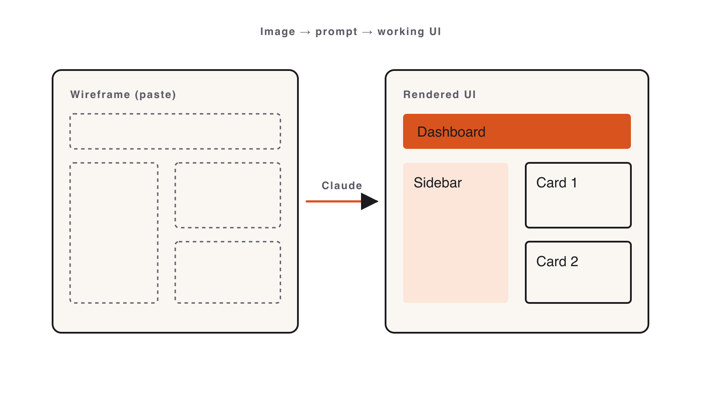
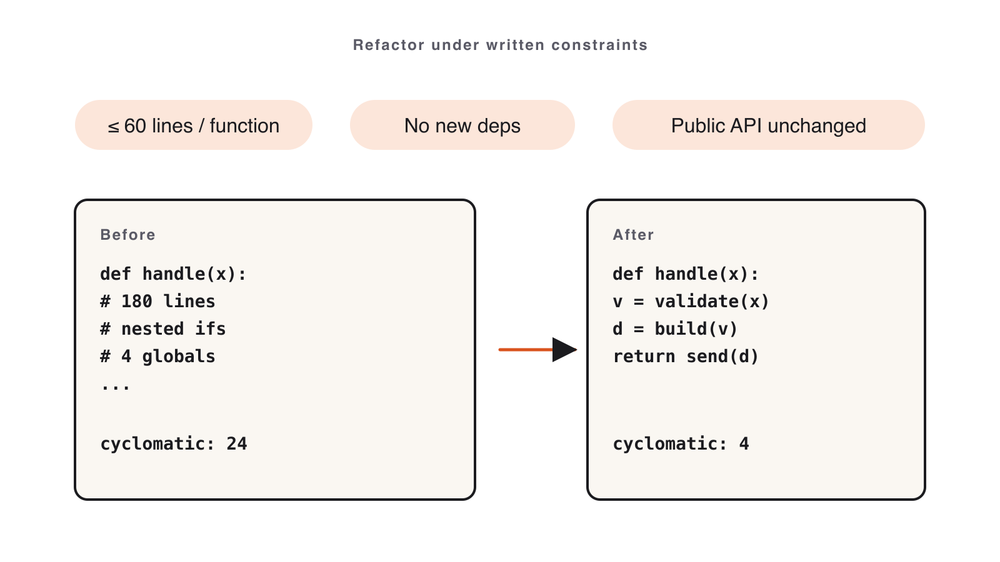
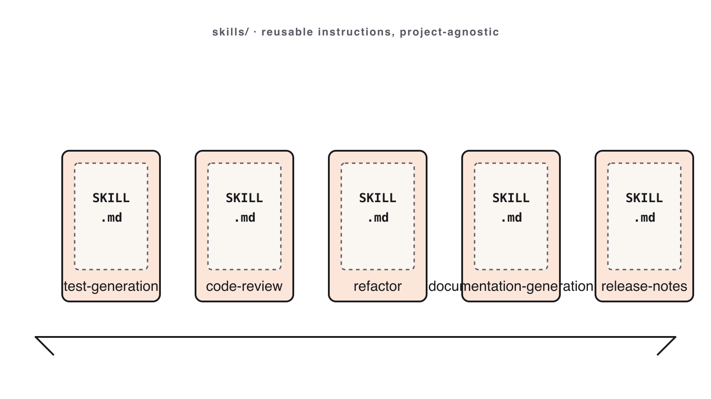

# Volume 3 — Beyond Code

_Source: https://leanpub.com/library/take/leanpub/claude-code-masterclass/99479/4_

---

# Volume 3 — Beyond Code

Go past plain code generation: build UIs from images, refactor under written constraints, document from the diff, and package repeatable Skills.
---
## Multimodal: Screenshot to UI

📺 [Watch: youtube.com/watch?v=kYyX5s4DW2E](https://www.youtube.com/watch?v=kYyX5s4DW2E)

Figure 14. Watch the lesson — Multimodal: Screenshot to UI

**Claude can read a picture. Hand it a wireframe; get a working UI back.**

### Layout-first prompting

> Let Claude **read the layout** from the image; you describe what it **can’t** see.

- The image carries: structure, regions, relative sizes.
    
- You must state: framework, data source, interactivity — Claude can’t infer these.
    
- **Visual-diff loop:** render → screenshot → ask Claude “what’s missing?” → patch. **Cap at 3 rounds.**
    
- **Scope discipline:** ship the layout. Theming and animation are stretch goals.
    



Figure 15. Screenshot-to-UI: layout-first prompt, build, screenshot-diff loop

### markitdown — any file → Markdown

For **non-image** sources (PDF, DOCX, PPTX, XLSX, audio, video, HTML, ZIP, YouTube), convert to Markdown first — it’s cheap and LLM-native:

```bash
pip install 'markitdown[all]'
markitdown report.pdf > report.md
```

Then drop into the prompt: _“Attached is the converted Markdown of `report.pdf`.”_ Claude consumes tables and headings without burning vision tokens.

### Common mistakes

- “Looks close enough” — the whole point is precision; diff again.
    
- Pulling in Tailwind / shadcn (the constraint exists for a reason).
    
- Forgetting to attach the image.
    
- Iterating five rounds (cap at three).
    

### Worked example · Wireframe → running UI

1.  Open a wireframe image in Claude Code.
    
2.  Paste the prompt **with the framework constraint**:
    
    ```
    Build this wireframe as a Flask + Jinja app (no other deps): one route, one
    template. Match the layout — header, sidebar, main, footer. Run on localhost:5000.
    ```
    
3.  Save and run; screenshot it next to the wireframe, ask _“What’s missing?”_
    
4.  Apply one round of fixes; end on a side-by-side comparison.
    

**Success signal:** the app runs with one command and the layout clearly matches the wireframe.

### Try it yourself · Dashboard from wireframe

Build a single-page dashboard matching a wireframe (static data OK):

```
Header (title + primary action) · Sidebar (3–5 nav links)
Main (3 KPI cards + table of 5 rows) · Footer (version string)
```

Run the **visual-diff loop** at least once; record patches in `diff-notes.md`.

**Definition of done**

- [ ] Runnable app; header, sidebar, 3 KPI cards, 5-row table, footer all present.
    
- [ ] `render-final.png` at 1280×720.
    
- [ ] `diff-notes.md` records ≥ 1 visual-diff round.
    

**Next:** we take messy code and make it clean _under constraints_, then document it.
---
## Hands-on exercise

> **Companion repository** — Work this exercise from the live files in the [Claude Code Bootcamp repository](https://github.com/lucab85/Claude-Code-Bootcamp): [`exercises/part-07/README.md`](https://github.com/lucab85/Claude-Code-Bootcamp/blob/main/exercises/part-07/README.md). Reference solution: [`exercises/part-07/solution/README.md`](https://github.com/lucab85/Claude-Code-Bootcamp/blob/main/exercises/part-07/solution/README.md).

### Goal

Hand Claude a wireframe image, generate a working single-page Dashboard, and iterate one round of visual diff.

### Scenario

A designer hands you a wireframe at the standup. By lunch you have a runnable UI that matches it. The lift is in _not_ translating the image to words — Claude reads it.

### Starter instructions

1.  Choose your wireframe (both PNGs are committed in this folder, ready to attach):
    
    - `wireframe.png` — canonical, generated from `wireframe.mmd` (Mermaid).
        
    - `wireframe-sketch.png` — rough hand sketch, generated from `wireframe-sketch.svg` (Excalidraw export).
        
    
2.  Choose framework: Flask + Jinja **or** Streamlit (Python only this module).
    
3.  Create `module-07/`.
    

> **The `.png` files ship in this folder — just attach one to your prompt.** The `.mmd` and `.svg` files are the editable sources of truth; the `.png` files are their renders. You only need to re-render if you _edit_ a source:
> 
> ```bash
> ./render-wireframes.sh
> # or manually:
> npx -y @mermaid-js/mermaid-cli -i wireframe.mmd -o wireframe.png -w 1280 -H 720
> rsvg-convert -w 1280 -h 720 wireframe-sketch.svg -o wireframe-sketch.png
> ```

### Claude Code prompt to use

```
INITIAL GENERATION
Below is a wireframe image. Build a working single-page web app matching the layout.

Constraints:
- Python 3.11. Track A: Flask + Jinja templates. Track B: Streamlit. Pick one and state the choice in the README.
- Static hardcoded sample data. No database. No auth.
- Single command to run: `python app.py` (Flask) or `streamlit run app.py`.
- Plain CSS, no Tailwind, no component libraries.
- Render at 1280x720 should look unmistakably like the wireframe.
```

> **Give Claude a `.png` it can actually see.** Claude Code can read a `.png` from the working folder on its own (you’ll see it run `Read wireframe.png`), or you can drag the image straight into the prompt — either works. What does **not** work is pointing it at the **`.svg`/`.mmd`** sources: those are text, not a raster image, so Claude can’t view them as a picture and you’ll get _“I don’t see a wireframe image attached.”_ Both `.png` files are committed in this folder for exactly this reason.

```
VISUAL DIFF
Image 1: the wireframe.
Image 2: my current render.

List the gaps in priority order. For each gap:
- One-sentence description.
- Smallest patch that closes it.

Stop after 5 items.
```

### Manual validation steps

```bash
cd module-07
python app.py        # or: streamlit run app.py
# Open the URL the framework prints
# Take a screenshot at 1280x720 → render-final.png
```

Side-by-side compare `wireframe.png` and `render-final.png`. Confirm header, sidebar, 3 KPI cards, table of 5 rows, footer.

### Expected deliverable

```
module-07/
├── app.py                # plus templates/ if Flask
├── render-final.png      # 1280x720 screenshot
└── diff-notes.md         # the visual-diff list + which fixes you applied
```

### Definition of done

- [ ] App runs with one command.
    
- [ ] Render is unmistakably the wireframe.
    
- [ ] All 5 layout regions present: header, sidebar, 3 KPI cards, table (5 rows), footer.
    
- [ ] Visual-diff loop ran at least once.
    

### Stretch challenge

Theme the dashboard (light + dark) using only plain CSS variables. Document the prompt in `module-07/theme-notes.md`.

### Troubleshooting

| Symptom | Fix |
| --- | --- |
| Claude can’t see the image | Make sure a `.png` is in the folder (or drag it into the prompt). Claude Code reads `.png` from disk; it cannot view `.svg`/`.mmd`. |
| “I don’t see a wireframe image attached” | You only have the `.svg`/`.mmd` source, not a viewable image. Use `wireframe.png` (or `wireframe-sketch.png`) — both are committed here. |
| Render uses Tailwind | Re-prompt with the “plain CSS” constraint reinforced. |
| Layout is “close” but not right | Run the visual-diff loop; cap at 3 iterations. |
| Streamlit sidebar collapses oddly | Use `st.sidebar` explicitly; layout is constrained — that’s expected. |
| `pip install flask` fails (pyexpat / Python 3.14) | Use uv instead: `uv run --with flask python app.py` (or `uv run --with streamlit streamlit run app.py`) — no global install needed. |

## Solution

Single-page Dashboard rendered with Flask + plain CSS. Matches `wireframe.png`.

### Install

```bash
pip install flask
```

### Run

```bash
python app.py
```

Open http://localhost:5000 — render at 1280×720 should be unmistakably the wireframe (header, sidebar, 3 KPI cards, table of 5 rows, footer).

### Layout regions

- Header bar with title + primary action
    
- Left sidebar with 5 nav links
    
- Main: 3 KPI cards across the top, then a 5-row table
    
- Footer with version string
---
## Refactoring & Documentation at Scale

📺 [Watch: youtube.com/watch?v=d_kbz-7R4mQ](https://www.youtube.com/watch?v=d_kbz-7R4mQ)

Figure 16. Watch the lesson — Refactoring & Documentation at Scale

**Refactor under written constraints. Document from the diff — never from the prompt.**

### Constrained refactor + two-pass docs

> **Tell Claude what may NOT change:** public API, file count, runtime behavior.

- **Two-pass workflow** — keep them separate:
    
    - **Pass 1:** refactor for readability only.
        
    - **Pass 2:** generate docs **from the diff**.
        
    
- **`HANDOFF.md`** — one-pager for the next engineer: what changed · why · risk · watch-outs.
    
- **`ARCHITECTURE.md`** — component shape, data flow, **one** diagram (ASCII is fine), known limits.
    

**Combine the two passes and the docs describe your prompt, not the code.**



Figure 17. Constrained refactor: constraints.md fixes what must not change, then two-pass docs

### constraints.md (write it first)

```
# Refactor constraints

## May change
- Internal function structure, names, early returns.

## Must NOT change
- Public function signatures / CLI flags.
- File count (no new modules).
- Observable runtime behavior — tests must stay green.

## Style
- Replace nested conditionals with early returns.
- No comments unless they explain *why*.
```

### Common mistakes

- Skipping `constraints.md` → Claude rewrites everything → lab spent reading.
    
- Combining refactor + docs in one prompt → docs describe the prompt.
    
- Vetoing every unrequested change (some are fine — read the diff).
    
- 200-line `ARCHITECTURE.md` (trim aggressively).
    

### Worked example · Bad vs. constrained refactor

1.  Open a messy module. Show the **unconstrained** refactor → bloated diff.
    
2.  Reset. Paste the **constrained** prompt:
    
    ```
    Refactor for readability only, obeying constraints.md exactly. Do not change
    public signatures, file count, or behavior. Tests must stay green. Show the diff.
    ```
    
3.  Run tests → still green.
    
4.  Pass 2: generate `HANDOFF.md` from the diff; read it aloud.
    

**Success signal:** the constrained diff respects every line of `constraints.md` and tests stay green.

### Try it yourself · Refactor + handoff docs

1.  Copy the messy module to `module-08/after/`.
    
2.  Write `constraints.md` **before** touching code.
    
3.  Refactor for readability only; re-run the existing tests (must stay green).
    
4.  Pass 2 — generate `HANDOFF.md` and `ARCHITECTURE.md` from the diff.
    

**Definition of done**

- [ ] Tests still green; diff respects every constraint.
    
- [ ] `HANDOFF.md` ≤ 40 lines, all four sections.
    
- [ ] `ARCHITECTURE.md` ≤ 80 lines, has a diagram + component paragraphs.
    

**Next:** we graduate from prompts to _agentic engineering_ — Skills, Hooks, MCP, multi-agent.
---
## Hands-on exercise

> **Companion repository** — Work this exercise from the live files in the [Claude Code Bootcamp repository](https://github.com/lucab85/Claude-Code-Bootcamp): [`exercises/part-08/README.md`](https://github.com/lucab85/Claude-Code-Bootcamp/blob/main/exercises/part-08/README.md). Reference solution: [`exercises/part-08/solution/README.md`](https://github.com/lucab85/Claude-Code-Bootcamp/blob/main/exercises/part-08/solution/README.md).

### Goal

Refactor a deliberately messy Python module under hard written constraints. Ship `HANDOFF.md` and `ARCHITECTURE.md` from the diff.

### Scenario

You’ve inherited a 200-line Python module nobody wants to touch. You have 24 minutes. You will write the constraints **first**, run a constrained refactor, and produce two short docs from the diff.

### Starter instructions

1.  Read `solution/before/`. The mess is intentional — note what bothers you.
    
2.  Copy `solution/before/` to `module-08/after/`.
    
3.  Create `module-08/constraints.md` and write your constraint list **before** prompting Claude.
    

### Claude Code prompt to use

```
CONSTRAINED REFACTOR
You will refactor the module below for readability only.

HARD CONSTRAINTS
- No new files. No new dependencies.
- Public function signatures unchanged. Module-level imports unchanged.
- Behavior on all existing tests must be byte-identical.
- Replace nested conditionals with early returns where it shortens code.
- Rename local variables only when the new name is materially clearer.
- No comments unless they explain a non-obvious *why*.

Output: a unified diff. No prose around it.
```

```
HANDOFF.md
Generate a one-page HANDOFF.md from the diff below. Sections:
- What changed (3 bullets max)
- Why
- Risk + how to roll back
- Watch-outs for the next engineer (specific, not generic)
Keep under 40 lines.
```

```
ARCHITECTURE.md
Read the refactored module and produce ARCHITECTURE.md.
- One ASCII diagram (boxes and arrows) of components and data flow.
- A short paragraph per component (purpose, inputs, outputs).
- A "Known limitations" list with at most 5 items.
Keep under 80 lines.
```

### Manual validation steps

```bash
cd module-08/after
python -m pytest    # all tests still green
wc -l ../HANDOFF.md         # ≤ 40
wc -l ../ARCHITECTURE.md    # ≤ 80
```

Diff `module-08/after/` against `solution/before/` and confirm every change is justified by a line in `constraints.md`.

### Expected deliverable

```
module-08/
├── after/             # refactored source
├── HANDOFF.md
├── ARCHITECTURE.md
└── constraints.md
```

### Definition of done

- [ ] Existing tests still pass on `after/`.
    
- [ ] `constraints.md` was written before the refactor (commit timestamp confirms).
    
- [ ] `HANDOFF.md` ≤ 40 lines, all four sections present.
    
- [ ] `ARCHITECTURE.md` ≤ 80 lines, has a diagram + per-component paragraphs + ≤ 5 limitations.
    

### Stretch challenge

Run the **unconstrained** refactor first. Save its diff. Compare line counts and “things changed unnecessarily” between the two diffs in `module-08/comparison.md`.

### Troubleshooting

| Symptom | Fix |
| --- | --- |
| Claude rewrites public signatures | Tighten the constraint list; re-prompt. |
| Tests now fail | Reset and re-run with the byte-identical-behavior constraint reinforced. |
| Docs describe the prompt, not the diff | Always paste the **diff** as input, not the prompt. |
| `ARCHITECTURE.md` is 200 lines | Hard cap at 80; trim limitations + paragraphs. |

## Solution

The `before/` folder contains a deliberately messy `pricing.py` and a passing test suite. Students copy it to `module-08/after/` and refactor under hard constraints. The `after/` folder here is a **reference refactor** (a real constrained-refactor run) — same tests, same behaviour, readable code.

### Run the tests

```bash
cd before/                 # or: cd after/
pip install pytest         # broken pip? use: uv run --with pytest pytest -q
pytest -q
```

All tests must remain green after the refactor — that’s the contract. Both `before/` and `after/` pass the identical suite (8 tests), which is the whole point: a readability refactor must not change behaviour.

### Reference HANDOFF and ARCHITECTURE

A reference `HANDOFF.md` and `ARCHITECTURE.md` live below; instructors compare student output against them but accept any version that satisfies the deliverable checklist in the exercise README.

## Reference code

**Before — the deliberately messy original (pricing.py)**

```
"""Order pricing — deliberately messy. Refactor in Module 8.

Computes the final price of an order with discounts, taxes, and shipping.
"""

def calc(items, country, customer):
    # items: list of (name, qty, unit_price)
    # country: ISO-2 country code
    # customer: dict with optional keys: vip, coupon
    t = 0
    for it in items:
        if it != None:
            if len(it) == 3:
                n, q, p = it[0], it[1], it[2]
                if q > 0:
                    if p > 0:
                        sub = q * p
                        if customer != None:
                            if customer.get('vip') == True:
                                sub = sub * 0.9
                            else:
                                if customer.get('coupon') != None:
                                    if customer['coupon'] == 'SAVE10':
                                        sub = sub * 0.9
                                    elif customer['coupon'] == 'SAVE20':
                                        sub = sub * 0.8
                                    else:
                                        pass
                        t = t + sub
                    else:
                        pass
                else:
                    pass
            else:
                pass
        else:
            pass
    # tax
    if country == 'US':
        tax = t * 0.07
    elif country == 'GB':
        tax = t * 0.20
    elif country == 'DE':
        tax = t * 0.19
    elif country == 'FR':
        tax = t * 0.20
    else:
        tax = t * 0.10
    # shipping
    if t < 50:
        ship = 9.99
    else:
        if t < 200:
            ship = 4.99
        else:
            ship = 0.0
    final = t + tax + ship
    return round(final, 2)
```

**After — the constrained refactor (same 8 tests stay green)**

```
"""Order pricing — refactored for readability (Module 8 reference "after").

Computes the final price of an order with discounts, taxes, and shipping.

Refactor notes (constrained: signature + imports + behaviour unchanged):
- Deep nested conditionals replaced with `continue` guards in the loop.
- `t`/`it`/`q`/`p` renamed to `subtotal`/`item`/`qty`/`unit_price`.
- Tax if/elif chain replaced with a lookup table + `.get` default.
- All eight tests in test_pricing.py stay green.
"""

def calc(items, country, customer):
    # items: list of (name, qty, unit_price)
    # country: ISO-2 country code
    # customer: dict with optional keys: vip, coupon
    subtotal = 0

    for item in items:
        if item is None:
            continue
        if len(item) != 3:
            continue

        name, qty, unit_price = item

        if qty <= 0 or unit_price <= 0:
            continue

        line_total = qty * unit_price

        if customer and customer.get('vip'):
            line_total *= 0.9
        elif customer and customer.get('coupon') == 'SAVE10':
            line_total *= 0.9
        elif customer and customer.get('coupon') == 'SAVE20':
            line_total *= 0.8

        subtotal += line_total

    tax_rates = {
        'US': 0.07,
        'GB': 0.20,
        'DE': 0.19,
        'FR': 0.20,
    }
    tax = subtotal * tax_rates.get(country, 0.10)

    if subtotal < 50:
        shipping = 9.99
    elif subtotal < 200:
        shipping = 4.99
    else:
        shipping = 0.0

    final = subtotal + tax + shipping
    return round(final, 2)
```
---
## Skills & Workflows

📺 [Watch: youtube.com/watch?v=xCFIvtwsPOo](https://www.youtube.com/watch?v=xCFIvtwsPOo)

Figure 18. Watch the lesson — Skills & Workflows

**Stop re-typing workflows. Package them. This is agentic engineering.**

### Four pillars of agentic engineering

1.  **Skills** — packaged workflows at `.claude/skills/<name>/SKILL.md`, invoked with `/<name>`. Your carry-out from this course.
    
2.  **Hooks** — shell commands that fire before/after Claude actions (format, lint, deny dangerous commands).
    
3.  **MCP** — open connectors to issue trackers, docs, chat, internal tools, read as first-class context.
    
4.  **Multi-agent** — a lead agent fans work out to workers in separate worktrees.
    

> Skills are the unit you’ll reuse most. The rest make Claude a teammate, not a chatbot.



Figure 19. Agentic engineering pillars: Skills, Hooks, MCP, Multi-agent

### Hooks & MCP at a glance

**Hooks** — `.claude/hooks.json`:

- `post-edit` → `npx prettier --write` (auto-format).
    
- `pre-bash` → deny `rm -rf` (guardrail).
    
- `pre-commit` → run tests (no broken commits).
    

**MCP (Model Context Protocol)** — connect, don’t paste: Jira / Linear / GitHub · Drive / Notion · Slack. **Least privilege:** read scope unless you truly need write.

### Multi-agent & common mistakes

**Multi-agent fan-out** — a lead splits a feature across workers (backend / frontend / tests) in separate worktrees. **Don’t** use it for tasks < 30 min, shared mutable state, or non-independent sub-tasks.

**Common mistakes**

- Vague skill body (“do a good job”).
    
- Project-specific paths/versions in a skill (won’t carry over).
    
- Skipping the **Worked example** (reviewers can’t tell if it works).
    
- Fanning out 4 agents on a 10-minute task.
    

### Worked example · Author a Skill in 4 minutes

1.  Open an existing `SKILL.md`; read its H2 headers aloud.
    
2.  Paste the drafting prompt:
    
    ```
    Draft a SKILL.md named "score-candidates" using the same H2 sections as
    code-review/SKILL.md. Purpose: score 3 diffs on Correctness, Simplicity, Fit.
    ```
    
3.  Invoke it: `/score-candidates` on three diffs.
    
4.  Observe Claude produce output matching the skill’s **Outputs** section.
    

**Success signal:** the new skill runs and its output matches its own spec — no extra prompting.

### Try it yourself · Author a reusable Skill

Write one **project-agnostic** skill for a workflow you’ll repeat (e.g. `commit-and-pr`, `screenshot-diff`, `regression-postmortem`):

- Valid frontmatter (`name`, `description`); all **6 H2 sections** in order; body ≤ 80 lines.
    
- **No** project-specific paths, filenames, or versions.
    

**Deliverables:** `module-09/skill/SKILL.md` · `module-09/invocation.md` (one real invocation + output).

**Next:** a ready-made library of ten skills — see Appendix A.
---
## Hands-on exercise

> **Companion repository** — Work this exercise from the live files in the [Claude Code Bootcamp repository](https://github.com/lucab85/Claude-Code-Bootcamp): [`exercises/part-09/README.md`](https://github.com/lucab85/Claude-Code-Bootcamp/blob/main/exercises/part-09/README.md). Reference solution: [`exercises/part-09/solution/README.md`](https://github.com/lucab85/Claude-Code-Bootcamp/blob/main/exercises/part-09/solution/README.md).

### Goal

Turn the Notes API you built in Module 4 into a **repeatable workflow**: author a skill that smoke-tests it, wire a **hook that actually fires** and blocks a broken commit, then run **one scoped MCP action** against GitHub. Every step produces something you can run and check — no abstract write-ups. Multi-agent fan-out is the stretch.

### Scenario

You shipped a Notes API in Module 4 and tested it in Module 5. On Monday a teammate will touch it. You want three guardrails in place: a skill anyone can invoke to verify the API in one command, a pre-commit hook that refuses to let a broken API land, and a GitHub action that files the result — without handing the agent your whole repo. By the end you will have _run_ each guardrail and watched it work (and watched the hook reject a bad commit).

### Starter instructions

1.  Copy your Module-4 winner into the working folder so the skill has something real to test:
    
    ```bash
    mkdir -p module-09
    cp ../part-04/solution/python/winner/notes_api.py module-09/   # or your own
    ```
    
2.  Read `skills/code-review/SKILL.md` (skill structure) and `skills/mcp-context-brief/SKILL.md` (how to bound an MCP call).
    
3.  Skim the skill contract: valid frontmatter (`name`, `description`) plus six H2 sections — Purpose · When to use · Body · Inputs · Outputs · Worked example.
    
4.  Work inside `module-09/` from here on.
    

### Claude Code prompt to use

```
AUTHOR A SKILL THAT TESTS REAL CODE
Following specs/001-bootcamp-course-materials/contracts/skill.contract.md,
write module-09/skill/SKILL.md for a skill called `notes-api-smoke`.
Purpose: boot a single-file FastAPI notes app and assert its 5 endpoints
(POST/GET/GET-by-id/PATCH/DELETE) return 201/200/200/200/204 and that
GET /notes/999 returns 404. The Worked example must be a runnable bash
block using `uv run --with fastapi --with uvicorn` + curl, printing PASS
or FAIL per endpoint. Body must be project-agnostic (take the module path
and port as inputs), but the worked example targets module-09/notes_api.py.
```

```
INVOKE THE SKILL FOR REAL
Use the `notes-api-smoke` skill at module-09/skill/SKILL.md against
module-09/notes_api.py on port 8099. Run it, then paste the actual
PASS/FAIL output into module-09/invocation.md. Do not fabricate results.
```

```
WIRE A HOOK THAT ACTUALLY FIRES
Create module-09/.claude/hooks.json with one pre-commit hook that runs the
`notes-api-smoke` skill and exits non-zero on any FAIL. Then prove it:
introduce a one-line bug in notes_api.py (e.g. return 500 on GET /notes),
attempt a commit, and show the hook BLOCKING it. Capture the blocked-commit
terminal output in module-09/hook-fired.md, then revert the bug.
```

```
RUN ONE SCOPED MCP ACTION
Following `skills/mcp-context-brief/SKILL.md`, write a 5-line brief at the top
of module-09/mcp-run.md (task, server, scope = ONE repo, allowed action =
open one issue, stop condition). Then use the GitHub MCP server to open an
issue titled "notes-api-smoke: <PASS|FAIL> on <date>" with the skill output
as the body. If no GitHub MCP server is configured, run it in dry-run and
record the exact tool call it WOULD make. Append the result to mcp-run.md.
```

### Manual validation steps

1.  Skill is well-formed:
    
    ```
    head -10 module-09/skill/SKILL.md           # YAML frontmatter: name + description
    grep -E '^## ' module-09/skill/SKILL.md      # Purpose · When to use · Body · Inputs · Outputs · Worked example
    ```
    
2.  Skill actually runs and passes against the good API: follow the worked example’s bash block and expect `PASS` for all five endpoints and the 404 probe.
    
3.  Hook really blocks: with the bug applied, `git commit` exits non-zero and prints a FAIL line. `module-09/hook-fired.md` shows it.
    
4.  MCP run is scoped: `module-09/mcp-run.md` names exactly one repo, one allowed action, and either a real issue URL or the dry-run tool call.
    

### Expected deliverable

```
module-09/
├── notes_api.py            # carried over from Module 4 (the system under test)
├── skill/
│   └── SKILL.md            # notes-api-smoke — runnable worked example
├── .claude/
│   └── hooks.json          # one pre-commit hook that runs the skill
├── invocation.md           # real PASS/FAIL output from running the skill
├── hook-fired.md           # terminal proof the hook blocked a broken commit
└── mcp-run.md              # 5-line brief + real issue URL (or dry-run tool call)
```

### Definition of done

- [ ] `notes-api-smoke/SKILL.md` has valid frontmatter and all 6 H2 sections in order: Purpose · When to use · Body · Inputs · Outputs · Worked example.
    
- [ ] The worked example **runs as written** and prints PASS for all five endpoints + the 404 probe — captured in `invocation.md`.
    
- [ ] Skill body is project-agnostic (path + port are inputs); no hard-coded `module-09` or framework version inside the Body section.
    
- [ ] `hooks.json` registers a pre-commit hook that runs the skill and **exits non-zero on FAIL**.
    
- [ ] `hook-fired.md` shows a real blocked commit (FAIL → commit aborted), and the bug was reverted afterward.
    
- [ ] `mcp-run.md` opens with a ≤5-line brief (one repo, one allowed action, stop condition) and ends with a real issue URL **or** the exact dry-run tool call.
    

### Stretch challenge

Run the same verification with a **multi-agent fan-out**: a “lead” plus two “worker” agents (or two agents isolated in separate `git worktree`s) each smoke-test a different candidate API, and the lead picks the winner. Capture the comparison as `module-09/multi-agent-compare.md`. Note explicitly when fan-out is **worse** than a single agent — that’s the real learning.

### Troubleshooting

| Symptom | Fix |
| --- | --- |
| Skill body hard-codes `module-09/notes_api.py` | Move the path + port into the Inputs section; keep only the worked example concrete. |
| Worked example “passes” but never started the server | The example must boot the app (`uv run … uvicorn notes_api:app --port 8099 &`), wait for it, then curl. No server = no test. |
| `pip install` / `python3` fails (3.14 pyexpat) | Use `uv run --with fastapi --with uvicorn` everywhere — the skill and the hook. |
| Hook “fires” but commit still succeeds | The hook must `exit 1` on FAIL. Echoing a warning is not blocking. Re-check the exit code. |
| No GitHub MCP server configured | Run the action in dry-run and record the exact tool call + arguments. The point is scoping, not the network round-trip. |
| MCP brief balloons past 5 lines | The task is too big. One repo, one issue, one stop condition. |

## Solution

> **Stop**: only open this after you have authored your own `notes-api-smoke` skill, wired the hook, and run the MCP action.

This module’s deliverable is a **runnable bundle** built around the Notes API from Module 4:

```
module-09/
├── notes_api.py                    # carried over from Module 4 (system under test)
├── skill/
│   └── SKILL.md                    # notes-api-smoke — runnable worked example
├── .claude/
│   └── hooks.json                  # pre-commit hook that runs the skill
├── invocation.md                   # real PASS/FAIL output
├── hook-fired.md                   # proof the hook blocked a broken commit
├── mcp-run.md                      # 5-line brief + real issue URL / dry-run call
└── multi-agent-compare.md          # stretch — fan-out comparison
```

### Reference `SKILL.md` (skeleton — your Body must be project-agnostic)

````
---
name: notes-api-smoke
description: Boot a single-file FastAPI notes app and assert its 5 CRUD endpoints plus the 404 probe, printing PASS/FAIL per check.
---

## Purpose
Verify a notes API is wired correctly in one command, so a teammate can trust
it before building on top.

## When to use
Before committing changes to a notes-style CRUD API, or in a pre-commit hook.

## Body
1. Boot the app under test on the given port.
2. POST a note → expect 201; capture the id.
3. GET /notes and GET /notes/{id} → expect 200.
4. PATCH /notes/{id} → expect 200.
5. DELETE /notes/{id} → expect 204.
6. GET /notes/999 → expect 404.
7. Print `PASS <check>` or `FAIL <check>` per step; exit non-zero on any FAIL.

## Inputs
- module_path: path to the app module (default `notes_api.py`).
- port: free TCP port (default 8099).

## Outputs
- One `PASS`/`FAIL` line per check, then a final `RESULT: PASS|FAIL`.

## Worked example
```bash
PORT=8099
uv run --with fastapi --with uvicorn uvicorn notes_api:app --port "$PORT" &
SRV=$!; sleep 2
fail=0
code=$(curl -s -o /tmp/n.json -w '%{http_code}' -X POST localhost:$PORT/notes \
  -H 'content-type: application/json' -d '{"title":"a","body":"b"}')
[ "$code" = 201 ] && echo "PASS create" || { echo "FAIL create ($code)"; fail=1; }
id=$(sed -n 's/.*"id":\([0-9]*\).*/\1/p' /tmp/n.json)
[ "$(curl -s -o /dev/null -w '%{http_code}' localhost:$PORT/notes)" = 200 ] \
  && echo "PASS list" || { echo "FAIL list"; fail=1; }
[ "$(curl -s -o /dev/null -w '%{http_code}' localhost:$PORT/notes/$id)" = 200 ] \
  && echo "PASS get" || { echo "FAIL get"; fail=1; }
[ "$(curl -s -o /dev/null -w '%{http_code}' -X PATCH localhost:$PORT/notes/$id \
  -H 'content-type: application/json' -d '{"title":"z"}')" = 200 ] \
  && echo "PASS patch" || { echo "FAIL patch"; fail=1; }
[ "$(curl -s -o /dev/null -w '%{http_code}' -X DELETE localhost:$PORT/notes/$id)" = 204 ] \
  && echo "PASS delete" || { echo "FAIL delete"; fail=1; }
[ "$(curl -s -o /dev/null -w '%{http_code}' localhost:$PORT/notes/999)" = 404 ] \
  && echo "PASS 404" || { echo "FAIL 404"; fail=1; }
kill $SRV
[ "$fail" = 0 ] && echo "RESULT: PASS" || { echo "RESULT: FAIL"; exit 1; }
````

````
### Reference `.claude/hooks.json`

```json
{
  "hooks": {
    "pre_commit": [
      {
        "name": "notes-api-smoke",
        "command": "uv run --with fastapi --with uvicorn bash skill/run.sh notes_api.py 8099"
      }
    ]
  }
}
````

The hook **must exit non-zero on FAIL** — that is what blocks the commit. A hook that only echoes a warning is not a guardrail.

### Reference `hook-fired.md` (what proof looks like)

```bash
$ git commit -m "wip"
FAIL list (500)
RESULT: FAIL
husky/pre-commit: hook exited with code 1 — commit aborted
$ git checkout -- notes_api.py    # reverted the injected bug
```

### Reference `mcp-run.md` (5-line brief + result)

```
Task: file the smoke-test result as a GitHub issue.
Server: github (scope: repo acme/notes only).
Allowed: open ONE issue. Forbidden: everything else (no merges, no other repos).
Stop: when the issue is created (capture URL).

Result: opened https://github.com/acme/notes/issues/42
  title: "notes-api-smoke: PASS on 2026-05-30"
# If no MCP server is configured, record the dry-run instead:
# would call: github.create_issue(repo="acme/notes",
#   title="notes-api-smoke: PASS on 2026-05-30", body=<skill output>)
```

### Multi-agent fan-out (stretch)

The reference comparison smoke-tested **three candidate APIs**:

1.  Single agent runs the skill against all three in sequence.
    
2.  Lead + 2 workers — each worker tests one candidate, lead picks the winner.
    
3.  Two agents isolated in separate `git worktree`s on competing fixes.
    

The takeaway captured in `multi-agent-compare.md`: fan-out helps when the checks are **independent per candidate**; it hurts when the agents must agree on a single shared verdict and end up re-litigating each other’s output.

### Definition of done

See the exercise above.
---
## Appendix A — Skills Library

**Ten reusable skills. Drop the folder into any repo and invoke.**

Throughout this course, _skills are your carry-out_. This appendix is that carry-out — ten ready-made, path-agnostic skills you can use today.

### What’s a skill, again?

A `SKILL.md` file with YAML frontmatter that Claude reads and offers in its picker. Six sections, always the same shape:

> **Frontmatter** (`name`, `description`) · **Purpose** · **When to use** · **Body** · **Inputs** · **Outputs** · **Worked example**

Every skill here is **path-agnostic** — no repo names, no sample data. Drop it in unchanged.

### The 10 skills

| Skill | What it does |
| --- | --- |
| `claude-md-template` | Generate a `CLAUDE.md` |
| `code-review` | Structured review of a diff |
| `test-generation` | Focused test suite |
| `best-of-n` | N candidates, score, pick |
| `refactor` | Refactor under constraints |
| `release-notes` | `git log` → categorized notes |
| `security-checklist` | Scan against a checklist |
| `git-workflow` | Branch + PR with AI text |
| `documentation-generation` | README / ARCHITECTURE / HANDOFF |
| `production-readiness-review` | 5-axis readiness report |

### Install

1.  Copy the `skills/` folder into your repo root.
    
2.  Open Claude Code in that repo.
    
3.  Invoke any skill by name.
    

Pick the two you’ll use most this week and try them on a real project — that’s how they become habits instead of files.

> Licensed MIT — reuse freely.
---
## Quiz — Beyond Code
---
[

Up next

Volume 4 — Automation & Production

Make Claude a teammate: connect external tools over MCP, automate discipline with hooks, judge production readiness across five axes, and plan your Monday.

](/library/take/leanpub/claude-code-masterclass/99479/5)

## On this page

- [Multimodal: Screenshot to UI](/library/take/leanpub/claude-code-masterclass/99479/4#multimodal-screenshot-to-ui)
- [Layout-first prompting](/library/take/leanpub/claude-code-masterclass/99479/4#layout-first-prompting)
- [markitdown — any file → Markdown](/library/take/leanpub/claude-code-masterclass/99479/4#markitdown--any-file--markdown)
- [Common mistakes](/library/take/leanpub/claude-code-masterclass/99479/4#common-mistakes-5)
- [Worked example · Wireframe → running UI](/library/take/leanpub/claude-code-masterclass/99479/4#worked-example--wireframe--running-ui)
- [Try it yourself · Dashboard from wireframe](/library/take/leanpub/claude-code-masterclass/99479/4#try-it-yourself--dashboard-from-wireframe)
- [Hands-on exercise](/library/take/leanpub/claude-code-masterclass/99479/4#hands-on-exercise--module-07)
- [Goal](/library/take/leanpub/claude-code-masterclass/99479/4#goal-6)
- [Scenario](/library/take/leanpub/claude-code-masterclass/99479/4#scenario-6)
- [Starter instructions](/library/take/leanpub/claude-code-masterclass/99479/4#starter-instructions-6)
- [Claude Code prompt to use](/library/take/leanpub/claude-code-masterclass/99479/4#claude-code-prompt-to-use-6)
- [Manual validation steps](/library/take/leanpub/claude-code-masterclass/99479/4#manual-validation-steps-6)
- [Expected deliverable](/library/take/leanpub/claude-code-masterclass/99479/4#expected-deliverable-6)
- [Definition of done](/library/take/leanpub/claude-code-masterclass/99479/4#definition-of-done-11)
- [Stretch challenge](/library/take/leanpub/claude-code-masterclass/99479/4#stretch-challenge-6)
- [Troubleshooting](/library/take/leanpub/claude-code-masterclass/99479/4#troubleshooting-6)
- [Solution](/library/take/leanpub/claude-code-masterclass/99479/4#solution--module-07)
- [Install](/library/take/leanpub/claude-code-masterclass/99479/4#install-1)
- [Run](/library/take/leanpub/claude-code-masterclass/99479/4#run)
- [Layout regions](/library/take/leanpub/claude-code-masterclass/99479/4#layout-regions)
- [Refactoring & Documentation at Scale](/library/take/leanpub/claude-code-masterclass/99479/4#refactoring--documentation-at-scale)
- [Constrained refactor + two-pass docs](/library/take/leanpub/claude-code-masterclass/99479/4#constrained-refactor--two-pass-docs)
- [constraints.md (write it first)](/library/take/leanpub/claude-code-masterclass/99479/4#constraintsmd-write-it-first)
- [Common mistakes](/library/take/leanpub/claude-code-masterclass/99479/4#common-mistakes-6)
- [Worked example · Bad vs. constrained refactor](/library/take/leanpub/claude-code-masterclass/99479/4#worked-example--bad-vs-constrained-refactor)
- [Try it yourself · Refactor + handoff docs](/library/take/leanpub/claude-code-masterclass/99479/4#try-it-yourself--refactor--handoff-docs)
- [Hands-on exercise](/library/take/leanpub/claude-code-masterclass/99479/4#hands-on-exercise--module-08)
- [Goal](/library/take/leanpub/claude-code-masterclass/99479/4#goal-7)
- [Scenario](/library/take/leanpub/claude-code-masterclass/99479/4#scenario-7)
- [Starter instructions](/library/take/leanpub/claude-code-masterclass/99479/4#starter-instructions-7)
- [Claude Code prompt to use](/library/take/leanpub/claude-code-masterclass/99479/4#claude-code-prompt-to-use-7)
- [Manual validation steps](/library/take/leanpub/claude-code-masterclass/99479/4#manual-validation-steps-7)
- [Expected deliverable](/library/take/leanpub/claude-code-masterclass/99479/4#expected-deliverable-7)
- [Definition of done](/library/take/leanpub/claude-code-masterclass/99479/4#definition-of-done-12)
- [Stretch challenge](/library/take/leanpub/claude-code-masterclass/99479/4#stretch-challenge-7)
- [Troubleshooting](/library/take/leanpub/claude-code-masterclass/99479/4#troubleshooting-7)
- [Solution](/library/take/leanpub/claude-code-masterclass/99479/4#solution--module-08)
- [Run the tests](/library/take/leanpub/claude-code-masterclass/99479/4#run-the-tests)
- [Reference HANDOFF and ARCHITECTURE](/library/take/leanpub/claude-code-masterclass/99479/4#reference-handoff-and-architecture)
- [Reference code](/library/take/leanpub/claude-code-masterclass/99479/4#reference-code)
- [Skills & Workflows](/library/take/leanpub/claude-code-masterclass/99479/4#skills--workflows)
- [Four pillars of agentic engineering](/library/take/leanpub/claude-code-masterclass/99479/4#four-pillars-of-agentic-engineering)
- [Hooks & MCP at a glance](/library/take/leanpub/claude-code-masterclass/99479/4#hooks--mcp-at-a-glance)
- [Multi-agent & common mistakes](/library/take/leanpub/claude-code-masterclass/99479/4#multi-agent--common-mistakes)
- [Worked example · Author a Skill in 4 minutes](/library/take/leanpub/claude-code-masterclass/99479/4#worked-example--author-a-skill-in-4-minutes)
- [Try it yourself · Author a reusable Skill](/library/take/leanpub/claude-code-masterclass/99479/4#try-it-yourself--author-a-reusable-skill)
- [Hands-on exercise](/library/take/leanpub/claude-code-masterclass/99479/4#hands-on-exercise--module-09)
- [Goal](/library/take/leanpub/claude-code-masterclass/99479/4#goal-8)
- [Scenario](/library/take/leanpub/claude-code-masterclass/99479/4#scenario-8)
- [Starter instructions](/library/take/leanpub/claude-code-masterclass/99479/4#starter-instructions-8)
- [Claude Code prompt to use](/library/take/leanpub/claude-code-masterclass/99479/4#claude-code-prompt-to-use-8)
- [Manual validation steps](/library/take/leanpub/claude-code-masterclass/99479/4#manual-validation-steps-8)
- [Expected deliverable](/library/take/leanpub/claude-code-masterclass/99479/4#expected-deliverable-8)
- [Definition of done](/library/take/leanpub/claude-code-masterclass/99479/4#definition-of-done-13)
- [Stretch challenge](/library/take/leanpub/claude-code-masterclass/99479/4#stretch-challenge-8)
- [Troubleshooting](/library/take/leanpub/claude-code-masterclass/99479/4#troubleshooting-8)
- [Solution](/library/take/leanpub/claude-code-masterclass/99479/4#solution--module-09)
- [Reference SKILL.md (skeleton — your Body must be project-agnostic)](/library/take/leanpub/claude-code-masterclass/99479/4#reference-skillmd-skeleton--your-body-must-be-project-agnostic)
- [Reference hook-fired.md (what proof looks like)](/library/take/leanpub/claude-code-masterclass/99479/4#reference-hook-firedmd-what-proof-looks-like)
- [Reference mcp-run.md (5-line brief + result)](/library/take/leanpub/claude-code-masterclass/99479/4#reference-mcp-runmd-5-line-brief--result)
- [Multi-agent fan-out (stretch)](/library/take/leanpub/claude-code-masterclass/99479/4#multi-agent-fan-out-stretch)
- [Definition of done](/library/take/leanpub/claude-code-masterclass/99479/4#definition-of-done-14)
- [Appendix A — Skills Library](/library/take/leanpub/claude-code-masterclass/99479/4#appendix-a--skills-library)
- [What’s a skill, again?](/library/take/leanpub/claude-code-masterclass/99479/4#whats-a-skill-again)
- [The 10 skills](/library/take/leanpub/claude-code-masterclass/99479/4#the-10-skills)
- [Install](/library/take/leanpub/claude-code-masterclass/99479/4#install-2)
- [Quiz — Beyond Code](/library/take/leanpub/claude-code-masterclass/99479/4#quiz--beyond-code)
