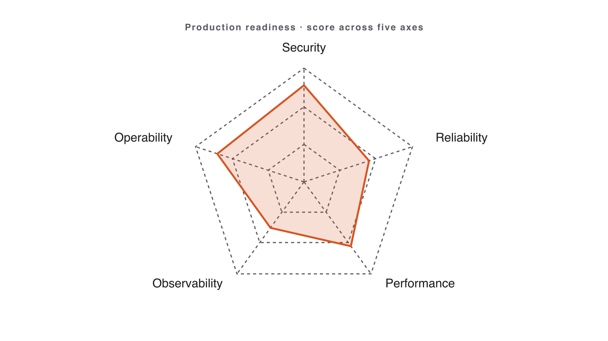

# Volume 4 — Automation & Production

_Source: https://leanpub.com/library/take/leanpub/claude-code-masterclass/99479/5_

---

# Volume 4 — Automation & Production

Make Claude a teammate: connect external tools over MCP, automate discipline with hooks, judge production readiness across five axes, and plan your Monday.
---
## MCP: Connect GitHub

📺 [Watch: youtube.com/watch?v=L_yrL1uXkEg](https://www.youtube.com/watch?v=L_yrL1uXkEg)

Figure 20. Watch the lesson — MCP: Connect GitHub

**Stop copy-pasting issues. Let Claude read GitHub as first-class context.**

### What MCP is

- **MCP** = Model Context Protocol — a standard way to plug **external tools** into Claude.
    
- A **server** exposes tools (read issues, list PRs, search code); Claude calls them directly.
    
- You add one with `claude mcp add-json` and scope its **permissions** via the token.
    

> **Least privilege:** grant **read** scope unless you truly need write. A token is a key — treat it like one. Never paste it into a prompt, a slide, or a commit.

### Step 1 · Create a PAT & store it safely

Create a GitHub Personal Access Token (scopes: `repo`, `issues`) under **Settings → Developer settings → Personal access tokens**, then keep it out of git:

```bash
echo "GITHUB_PAT=your_token_here" > .env
echo -e ".env\n.mcp.json" >> .gitignore
export GITHUB_PAT="$(grep '^GITHUB_PAT=' .env | cut -d '=' -f2-)"
```

### Step 2 · Register the GitHub MCP server

```bash
# Remote HTTP server (Claude Code 2.1.1+), token from the environment
claude mcp add-json github '{"type":"http",
  "url":"https://api.githubcopilot.com/mcp",
  "headers":{"Authorization":"Bearer '"$GITHUB_PAT"'"}}'

claude mcp list          # confirm it's connected
claude mcp get github    # inspect the server
```

Inside Claude Code, run `/mcp` to see live server status. Remove with `claude mcp remove github`.

### Step 3 · Open an issue from a bug report

```
Read module-05/bug_report.md. Using GitHub MCP, open a new issue in this
repo: title = the bug's one-line summary; body = the report (file, line,
expected vs. actual, suggested fix) with a "bug" label. Show me the issue
before creating it.
```

1.  Claude reads the bug report you generated when testing.
    
2.  It drafts a clean issue — title, labelled body, reproduction — and **shows you first**.
    
3.  You approve; it creates the issue **over MCP** and returns the issue number.
    

**Success signal:** a real GitHub issue is filed straight from your `bug_report.md` — no web UI, no copy-paste.

### Recap

- **MCP** connects Claude to real tools — read and write context instead of pasting it.
    
- Three steps — **PAT → `claude mcp add-json` → use** — wire up the GitHub server.
    
- **Least privilege + tokens in `.env`/environment**; you still review every action.
    

**Next:** automate discipline so good habits fire on every action — with hooks.
---
## Hooks

📺 [Watch: youtube.com/watch?v=AB1yZGVTQIM](https://www.youtube.com/watch?v=AB1yZGVTQIM)

Figure 21. Watch the lesson — Hooks

**Automate discipline. Shell commands that fire on every Claude action.**

### What a hook is

- A **shell command** Claude runs automatically on an event — no prompting.
    
- Common events: **PreToolUse** (gate/deny) and **PostToolUse** (format, lint, test).
    
- Configured in `.claude/settings.json`, pointing at your script.
    

> **Two big wins:** auto-format on every edit, and **deny** dangerous commands like `rm -rf` before they run.

### Step 1 · Write the hook script

`.claude/hooks/format.sh`:

```bash
#!/usr/bin/env bash
# Auto-format the file Claude just edited.
set -euo pipefail
file="$1"
case "$file" in
  *.py) black "$file" ;;
  *.js|*.ts) npx --yes prettier --write "$file" ;;
esac
echo "formatted: $file"
```

```
chmod +x .claude/hooks/format.sh   # make it executable
```

### Step 2 · Wire it into settings

`.claude/settings.json`:

```json
{
  "hooks": {
    "PostToolUse": [
      {
        "matcher": "Edit|Write",
        "hooks": [
          { "type": "command", "command": ".claude/hooks/format.sh" }
        ]
      }
    ]
  }
}
```

The **matcher** limits the hook to `Edit`/`Write` tools; Claude passes the edited file to your script.

### Step 3 · Make a sloppy edit & watch it fire

```
Add a function merge_dicts(a, b) to utils.py that returns a new dict with b's
keys overriding a's. Write it deliberately messy — leave it unformatted.
```

1.  Claude **writes** the file with bad indentation and spacing.
    
2.  **PostToolUse** fires `format.sh` automatically on that file.
    
3.  `black` rewrites it; you see `formatted: utils.py` print.
    

**Success signal:** you ask for a sloppy edit; the file lands already formatted — you did nothing.

> A messy starter file like `exercises/module-11/utils.py` is ideal practice for this: deliberately misformatted Python that a `PostToolUse` hook will clean up the moment Claude touches it.

[Hooks: choose the event](https://leanpub.com/courses/leanpub/claude-code-masterclass/quizzes/ex-hooks-events)

  

[Artboard 3Created with Sketch.Hooks: choose the eventStart Exercise](/library/take/leanpub/claude-code-masterclass/99479/quiz/99641)

### Recap

- A **hook** is a shell command Claude runs automatically on an event.
    
- **PostToolUse** formats and lints; **PreToolUse** gates dangerous commands.
    
- Write the habit **once** into a script — it’s enforced on every action.
    

**Next:** before you ship, judge production readiness across five axes.
---
## Production Readiness

📺 [Watch: youtube.com/watch?v=j61o-zHa9Tw](https://www.youtube.com/watch?v=j61o-zHa9Tw)

Figure 22. Watch the lesson — Production Readiness

**“It runs on my laptop” is not “ready to ship.” Make the call across five axes.**

### Five axes + a verdict

Score every shipping candidate on five axes that **always** matter:

> **Security · Observability · Deployment · Runbooks · Rollback**

- For each axis: one **status** (🟢/🟡/🔴) · one **biggest risk** · one **smallest next step**.
    
- Use a `production-readiness-review` skill as the durable instrument.
    
- **Go / no-go is a decision, not a vibe.** End with a verdict and a ≤ 25-word rationale.
    



Figure 23. Five production-readiness axes: Security, Observability, Deployment, Runbooks, Rollback

### Overeager agents

Research shows agents routinely take **out-of-scope** actions on benign tasks — editing unrequested files, running unapproved commands, silently expanding scope.

**Defences, in order:**

- **Least-privilege tools** — grant only what this task needs.
    
- **Permission modes** — `ask` for shell · `deny` for network · `read-only` zones.
    
- **Shell approval** — every command requires a tap until trust is earned.
    
- **Review before commit** — diff-first, always; never `--no-verify`.
    
- **Disaster recovery** — clean branch, atomic commits, easy `git reset --hard`.
    

### Common mistakes

- “All green, ready to ship” — almost never true after one workshop; be honest.
    
- Vague next steps (“improve security”) instead of one concrete action.
    
- 4-page reports — one page or it doesn’t get read.
    
- Skipping the verdict entirely.
    

### Worked example · Score the Notes API

1.  Pick the Module 4 Notes API.
    
2.  Paste the assessment prompt:
    
    ```
    Assess this repo for production readiness across 5 axes: Security, Observability,
    Deployment, Runbooks, Rollback. Status per axis + biggest risk + a go/no-go verdict.
    ```
    
3.  Walk through the 5-axis output; mark two red, three amber, none green.
    
4.  State the go / no-go with the smallest next step.
    

**Success signal:** an honest verdict with one concrete Monday-morning action.

### Try it yourself · Production Readiness Report

Pick **one** project from this course (likely Module 4) and assess it:

- Run the production-readiness skill against it.
    
- One page: 5 axes, each with **status · biggest risk · smallest next step**.
    
- End with a decisive **go / no-go** verdict (≤ 25-word rationale).
    

**Definition of done**

- [ ] All 5 axes covered.
    
- [ ] Honest go / no-go verdict with ≤ 25-word rationale.
    
- [ ] One concrete Monday-morning step.
    

**Next:** that’s the loop, many times over. We close with Q&A and Monday.
---
## Hands-on exercise

> **Companion repository** — Work this exercise from the live files in the [Claude Code Bootcamp repository](https://github.com/lucab85/Claude-Code-Bootcamp): [`exercises/part-10/README.md`](https://github.com/lucab85/Claude-Code-Bootcamp/blob/main/exercises/part-10/README.md). Reference solution: [`exercises/part-10/solution/README.md`](https://github.com/lucab85/Claude-Code-Bootcamp/blob/main/exercises/part-10/solution/README.md).

### Goal

Pick one project from today and write a one-page **Production Readiness Report** with a go / no-go verdict.

### Scenario

Hiring managers and tech leads want to know: would you ship what you built? Today you answer that, honestly, across 5 axes.

### Starter instructions

1.  Pick one module you’d actually be willing to defend. The Notes API (module 4) is the typical pick.
    
2.  Open `skills/production-readiness-review/SKILL.md`.
    
3.  Create `module-10/`.
    

### Claude Code prompt to use

```
PRODUCTION READINESS
Use the production-readiness-review skill against the project at <path>.

For each of the 5 axes (Security, Observability, Deployment, Runbooks, Rollback):
- One sentence answering: would this hold up in production this week?
- The single biggest risk.
- The single smallest next step that materially reduces the risk.

End with a one-line go / no-go verdict and the rationale (≤ 25 words).
```

### Manual validation steps

1.  Open `production-readiness-report.md`.
    
2.  Confirm 5 axes present, each with status + risk + next step.
    
3.  Confirm the verdict line exists and is decisive (“Go” or “No-Go” — not “maybe”).
    
4.  Confirm rationale is ≤ 25 words.
    

### Expected deliverable

```
module-10/
└── production-readiness-report.md
```

### Definition of done

- [ ] All 5 axes covered: Security, Observability, Deployment, Runbooks, Rollback.
    
- [ ] Each axis has status, biggest risk, smallest next step.
    
- [ ] Verdict line: Go / No-Go.
    
- [ ] Rationale ≤ 25 words.
    
- [ ] Report fits on one page.
    

### Stretch challenge

For one “yellow” axis, actually do the smallest next step. Commit the change. Document in `module-10/follow-up.md`.

### Troubleshooting

| Symptom | Fix |
| --- | --- |
| Everything “green” | Be honest. After one workshop, it’s not all green. Re-score. |
| Vague next steps | “Improve security” is not a step. “Add input validation to POST /notes” is. |
| Report > 1 page | Trim. One line per axis component if needed. |
| No verdict | The verdict is the point. Add it. |

## Solution

> **Stop**: only open this after you have produced your own `readiness-report.md` against a prior module.

This module’s deliverable is a **12-item production-readiness report**. The reference is a worked example against the Module 4 service.

```
module-10/
└── readiness-report.md        # 12-item report + GO / NO-GO verdict
```

### Reference `readiness-report.md` (against Module 4 FastAPI service)

```
# Production readiness — Module 4 service

Verdict: **NO-GO** (3 blockers).

| # | Item | Status | Evidence | Action if NOT |
|---|---|---|---|---|
| 1 | Secrets hygiene | ✓ | `.env` ignored; no keys in git history (`git log -p \| grep -iE 'api[_-]?key'`). | — |
| 2 | AuthN / AuthZ | ✗ | No auth on `/tasks` endpoints. | Add API-key middleware before public exposure. |
| 3 | Input validation | ✓ | Pydantic models reject empty `title`. | — |
| 4 | Error budgets | ✗ | No SLO defined. | Pick a 99.5% target for `/tasks`; alert on 5xx > 0.5%. |
| 5 | Idempotency | △ | `POST /tasks` not idempotent; client could double-submit. | Add `Idempotency-Key` header. |
| 6 | Observability | ✗ | No structured logs; no traces. | Add `structlog` + OTLP exporter. |
| 7 | Performance | ✓ | p95 < 50ms on 1k tasks (smoke). | — |
| 8 | Backwards compatibility | n/a | First release. | — |
| 9 | Disaster recovery | △ | SQLite file; no backup. | Document daily snapshot to S3. |
| 10 | Rollback | ✓ | Container image tagged per commit; previous tag re-deployable. | — |
| 11 | Permission scope | ✓ | Container runs as non-root UID 1000. | — |
| 12 | Human review | ✓ | This report counter-signed by senior eng. | — |
```

### How the `release-readiness` skill was used

The report was produced by invoking `skills/release-readiness/SKILL.md` with the Module 4 repo as input. The skill’s “Outputs” section specifies the exact table shape above.

### Hooks that would have caught the blockers earlier

```json
{
  "hooks": {
    "pre_commit": [
      { "name": "no-secrets", "command": "gitleaks protect --staged" }
    ]
  }
}
```

A `pre_commit` hook running `gitleaks` would have prevented item #1 from ever needing to be on the checklist.

### Definition of done

- [ ] All 12 items addressed with a concrete status.
    
- [ ] Verdict line at the top: **GO** or **NO-GO** (with blocker count).
    
- [ ] At least one blocker mapped to an action item with an owner.
---
## Q&A & Next Steps

📺 [Watch: youtube.com/watch?v=e8rs4PV9jww](https://www.youtube.com/watch?v=e8rs4PV9jww)

Figure 24. Watch the lesson — Q&A & Next Steps

**The projects are done. Now: the three frameworks you keep, and Monday.**

### Three frameworks you keep

Forget the syntax; keep these three:

1.  **The loop** — Plan → Implement → Test → Review → Commit (every non-trivial change).
    
2.  **The 40/40/20 rubric** — grade any AI output: 40% correctness · 40% quality · 20% fit.
    
3.  **The readiness checklist** — five axes before you tag a release.
    

> If you remember nothing else, remember the loop. It is the whole course in five words.

### The five most common mistakes

1.  **No plan** — jumping straight to “write the function”.
    
2.  **Skipping review** — accepting the first diff.
    
3.  **Letting Claude commit** — losing the human checkpoint.
    
4.  **Treating skills as files** instead of habits invoked deliberately.
    
5.  **No CLAUDE.md** — re-explaining stack + conventions every session.
    

Every one is a habit, not a knowledge gap. Fix the habit.

### Three prompting anti-patterns

| Anti-pattern | Symptom | Fix |
| --- | --- | --- |
| **“Fix it” loop** | Vague prompt → unfocused diff → re-prompt → drift | Paste the exact error + smallest reproducer |
| **Over-eager agent** | Long run → wrong abstraction → 600-line diff | Stop at the plan, review, _then_ implement |
| **Merge-without-review** | Claude commits + pushes in one shot | Review-before-commit, even when “obviously fine” |

### Worked example · “Fix it” loop vs. precise prompt

Reproduce the vague loop, then reset and paste a precise prompt:

```
GET /notes/999 returns 500, expected 404. KeyError 'note' in get_note() line 42.
Fix only this; keep all other behavior. Show the diff.
```

**Success signal:** the precise prompt fixes it in one pass; the vague loop doesn’t.

### Keep an eye on

The tools change monthly; the **habits** don’t.

| Watch for | Trick that compounds |
| --- | --- |
| Shared skill libraries across teams | Keep a `skills/` folder in every repo |
| MCP servers for more of your stack | Wire issue tracker · CI · observability in once |
| Multi-agent orchestration maturing | Delegate parallel work, keep **one** human reviewer — you |
| Hooks as default guardrails | Auto-format, secret-scan, test-gate on every action |
| Bigger context + memory files | Pin model + conventions in `CLAUDE.md` |

> The rule that survives every release: **Plan → Implement → Test → Review → Commit.**

### Try it yourself · The Monday sentence

No code this time — one sentence. Complete it and write it where you’ll see it:

> _“On Monday, I will use Claude Code to **\_\_\_** on my project **\_\_\_**, and I will stop the loop when **\_\_\_**.”_

**Definition of done — the whole course**

- [ ] Can name the core pillars from memory.
    
- [ ] Have your one-sentence Monday answer.
    

**Thank you.** You direct, you review, you merge — you’re the engineer of record. Go ship.
---
## Quiz — Automation & Production

## On this page

- [MCP: Connect GitHub](/library/take/leanpub/claude-code-masterclass/99479/5#mcp-connect-github)
- [What MCP is](/library/take/leanpub/claude-code-masterclass/99479/5#what-mcp-is)
- [Step 1 · Create a PAT & store it safely](/library/take/leanpub/claude-code-masterclass/99479/5#step-1--create-a-pat--store-it-safely)
- [Step 2 · Register the GitHub MCP server](/library/take/leanpub/claude-code-masterclass/99479/5#step-2--register-the-github-mcp-server)
- [Step 3 · Open an issue from a bug report](/library/take/leanpub/claude-code-masterclass/99479/5#step-3--open-an-issue-from-a-bug-report)
- [Recap](/library/take/leanpub/claude-code-masterclass/99479/5#recap)
- [Hooks](/library/take/leanpub/claude-code-masterclass/99479/5#hooks)
- [What a hook is](/library/take/leanpub/claude-code-masterclass/99479/5#what-a-hook-is)
- [Step 1 · Write the hook script](/library/take/leanpub/claude-code-masterclass/99479/5#step-1--write-the-hook-script)
- [Step 2 · Wire it into settings](/library/take/leanpub/claude-code-masterclass/99479/5#step-2--wire-it-into-settings)
- [Step 3 · Make a sloppy edit & watch it fire](/library/take/leanpub/claude-code-masterclass/99479/5#step-3--make-a-sloppy-edit--watch-it-fire)
- [Hooks: choose the event](/library/take/leanpub/claude-code-masterclass/99479/quiz/99641)
- [Recap](/library/take/leanpub/claude-code-masterclass/99479/5#recap-1)
- [Production Readiness](/library/take/leanpub/claude-code-masterclass/99479/5#production-readiness)
- [Five axes + a verdict](/library/take/leanpub/claude-code-masterclass/99479/5#five-axes--a-verdict)
- [Overeager agents](/library/take/leanpub/claude-code-masterclass/99479/5#overeager-agents)
- [Common mistakes](/library/take/leanpub/claude-code-masterclass/99479/5#common-mistakes-7)
- [Worked example · Score the Notes API](/library/take/leanpub/claude-code-masterclass/99479/5#worked-example--score-the-notes-api)
- [Try it yourself · Production Readiness Report](/library/take/leanpub/claude-code-masterclass/99479/5#try-it-yourself--production-readiness-report)
- [Hands-on exercise](/library/take/leanpub/claude-code-masterclass/99479/5#hands-on-exercise--module-10)
- [Goal](/library/take/leanpub/claude-code-masterclass/99479/5#goal-9)
- [Scenario](/library/take/leanpub/claude-code-masterclass/99479/5#scenario-9)
- [Starter instructions](/library/take/leanpub/claude-code-masterclass/99479/5#starter-instructions-9)
- [Claude Code prompt to use](/library/take/leanpub/claude-code-masterclass/99479/5#claude-code-prompt-to-use-9)
- [Manual validation steps](/library/take/leanpub/claude-code-masterclass/99479/5#manual-validation-steps-9)
- [Expected deliverable](/library/take/leanpub/claude-code-masterclass/99479/5#expected-deliverable-9)
- [Definition of done](/library/take/leanpub/claude-code-masterclass/99479/5#definition-of-done-15)
- [Stretch challenge](/library/take/leanpub/claude-code-masterclass/99479/5#stretch-challenge-9)
- [Troubleshooting](/library/take/leanpub/claude-code-masterclass/99479/5#troubleshooting-9)
- [Solution](/library/take/leanpub/claude-code-masterclass/99479/5#solution--module-10)
- [Reference readiness-report.md (against Module 4 FastAPI service)](/library/take/leanpub/claude-code-masterclass/99479/5#reference-readiness-reportmd-against-module-4-fastapi-service)
- [How the release-readiness skill was used](/library/take/leanpub/claude-code-masterclass/99479/5#how-the-release-readiness-skill-was-used)
- [Hooks that would have caught the blockers earlier](/library/take/leanpub/claude-code-masterclass/99479/5#hooks-that-would-have-caught-the-blockers-earlier)
- [Definition of done](/library/take/leanpub/claude-code-masterclass/99479/5#definition-of-done-16)
- [Q&A & Next Steps](/library/take/leanpub/claude-code-masterclass/99479/5#qa--next-steps)
- [Three frameworks you keep](/library/take/leanpub/claude-code-masterclass/99479/5#three-frameworks-you-keep)
- [The five most common mistakes](/library/take/leanpub/claude-code-masterclass/99479/5#the-five-most-common-mistakes)
- [Three prompting anti-patterns](/library/take/leanpub/claude-code-masterclass/99479/5#three-prompting-anti-patterns)
- [Worked example · “Fix it” loop vs. precise prompt](/library/take/leanpub/claude-code-masterclass/99479/5#worked-example--fix-it-loop-vs-precise-prompt)
- [Keep an eye on](/library/take/leanpub/claude-code-masterclass/99479/5#keep-an-eye-on)
- [Try it yourself · The Monday sentence](/library/take/leanpub/claude-code-masterclass/99479/5#try-it-yourself--the-monday-sentence)
- [Quiz — Automation & Production](/library/take/leanpub/claude-code-masterclass/99479/5#quiz--automation--production)
